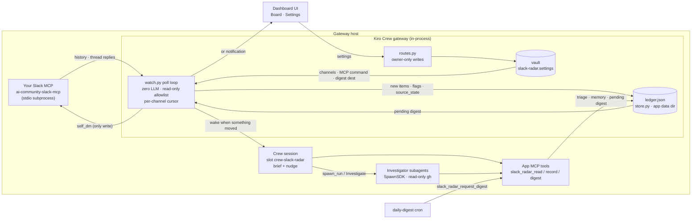
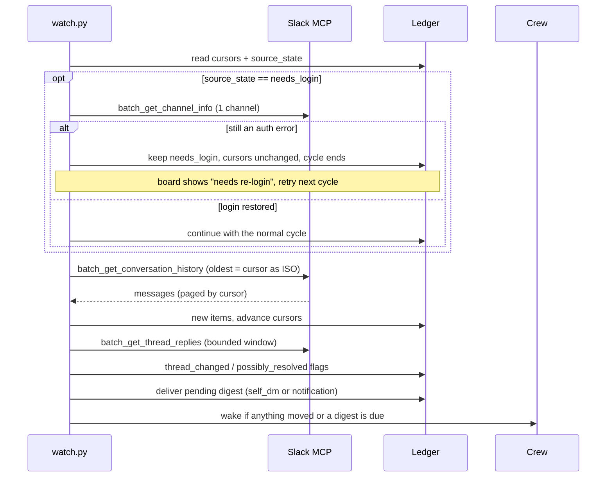
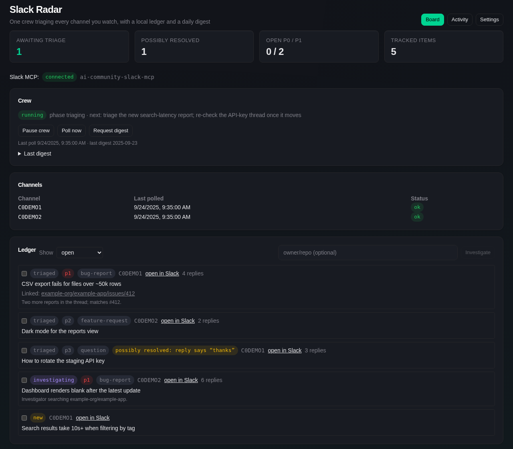
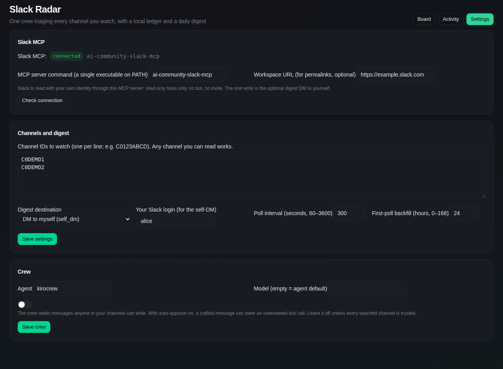
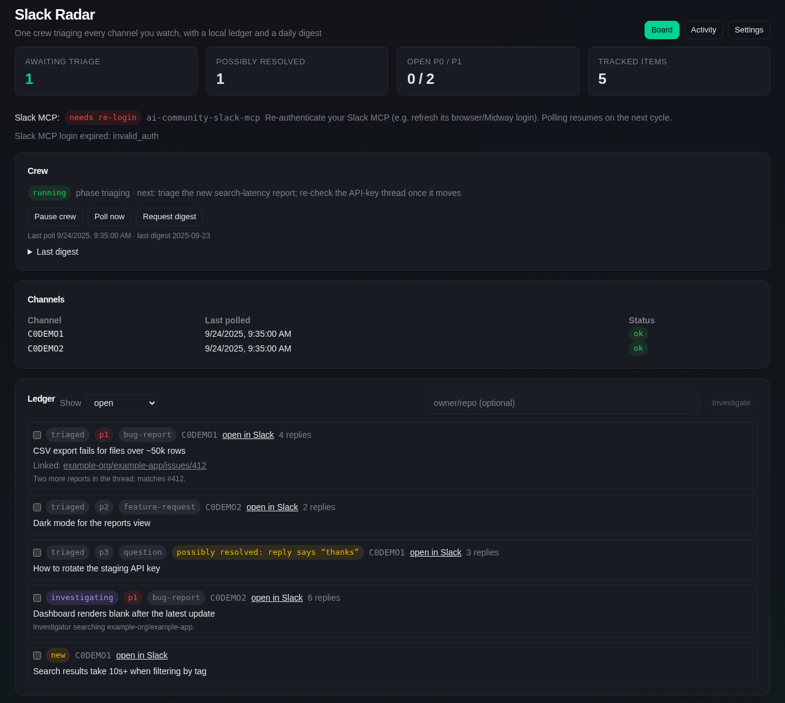

# Slack Radar

A Slack triage crew that remembers, reading with your own Slack identity through your Slack MCP server. No bot, no invite, nothing visible in the channel. Slack Radar watches the channels you choose, and one crew classifies every new message as a bug report, feature request, question, already-answered or noise with a priority, links clusters to existing GitHub issues and PRs through a read-only investigator, notices when a thread looks resolved, and sends you a daily digest. Everything it learns lives in a local ledger, so nothing is triaged twice. Modeled on the built-in Issue Radar app.

## Architecture



One poll cycle:



An auth error at any read in the cycle takes the `needs_login` branch before any cursor moves.

## What it looks like

Rendered from fake demo data (`docs/screenshots/capture/`); no real Slack content.

**Board**: MCP status, crew phase and next step, per-channel health, and the triaged ledger.



**Settings**: Slack MCP command and connection check, watched channels, digest destination.



**Login expired**: polling pauses and the board says so instead of showing an empty queue.



## Quick start

1. Have a Slack MCP server installed and logged in on the gateway host. The default is `ai-community-slack-mcp` on `PATH`; any server exposing the same read tools works (set its command in Settings).
2. Install and enable:

   ```bash
   kirocrew app install /path/to/slack-radar
   kirocrew app enable slack-radar
   ```

3. Open **Slack Radar → Settings**. Check that the status line reads *Slack MCP: connected*. List the channel IDs to watch (right-click a channel → *Copy link*, the `C…` segment). Any channel you can read works. Pick a digest destination: *DM to myself* (`self_dm`, needs your Slack login) or *Dashboard notification only*. Optionally set your workspace URL so permalinks open directly.
4. **Board → Start crew.** The first poll backfills the last 24 hours (configurable).
5. To get a digest on a schedule, resume the paused `daily-digest` cron (weekdays 16:00 UTC) in the Schedule view, or press **Request digest** on the Board.

Nothing is polled until at least one channel is set, and the crew never runs until you start it.

## Tabs

| Tab | What it shows |
|---|---|
| Board | Slack MCP status, counts, crew status (phase, next step, mid-turn, auto-approve), per-channel poll health, the last digest, and the ledger filtered by status. Select items and press **Investigate** to spawn the read-only GitHub investigator on them |
| Activity | The work log: polls that moved something, login lost/restored, crew notes, digests, settings changes |
| Settings | Slack MCP command and connection check, watched channels, digest destination, Slack login, poll interval, backfill, crew agent/model, and the auto-approve toggle |

## How it works

- **Slack MCP client** (`backend/slack_mcp.py`): the gateway spawns your Slack MCP server as a subprocess and speaks MCP over stdio (initialize, then `tools/call`), with no LLM involved. It restarts the process after a crash or timeout. A hard allowlist admits only `list_channels`, `batch_get_conversation_history`, `batch_get_thread_replies`, `batch_get_channel_info` and `batch_get_user_info`; any other tool name raises before it reaches the process. The one write, `self_dm`, is a separate method called only from the digest path.
- **Poller** (`backend/watch.py`): an in-gateway loop, zero LLM. One batched `batch_get_conversation_history` call per cycle for all channels, `oldest` = the app's own per-channel cursor converted to ISO-8601, paginated by cursor. Then one batched `batch_get_thread_replies` for a bounded window of open threads, flagging *possibly resolved* candidates (✅ reaction, "fixed"/"merged"/"thanks" replies, deleted parent). Code never marks an item resolved.
- **Login expiry**: an auth error from the MCP stops the cycle before any cursor moves and shows *needs re-login* on the board. Each later cycle makes one cheap read; polling resumes as soon as it succeeds. An expired login is never reported as "no new messages".
- **Crew** (`backend/crew_runtime.py`): one dashboard session, slot `crew-slack-radar`, for all channels. It is woken only when a poll moved something or a digest is due, so an idle workspace costs no turns. It carries `backend/crew_brief.md` (re-injected by presence check after compaction or restart) and records through the app's own ledger MCP tools. It never talks to Slack.
- **Ledger** (`data/ledger.json`, spec in `backend/crew_ledger_spec.md`): cursors, items, source state, the crew's resumable memory (`phase`, `next`, `tried`, `rejected`) and digest state.
- **Digest**: the crew picks top items and a headline. The gateway renders the text from the ledger's public fields and delivers it as a DM to yourself or a dashboard notification. Nothing is ever posted to a channel.

## Autonomy and security

- **No credential is stored.** The Slack MCP authenticates with your own browser/Midway session.
- **Settings are authority and live in the gateway's encrypted vault** (`~/.kiro/crew/.vault/`, entry `slack-radar.settings`, already on the keystone floor `security._CREW_SECRET_LEAVES`). `slack_mcp_command` is an execution selector the gateway spawns, the channel list decides what your identity reads into an agent-readable ledger, and the digest settings decide whether a DM is sent. Agents can neither read nor write the entry. `slack_mcp_command` must be a single executable (no arguments, no shell syntax) and is spawned without a shell.
- Settings, MCP probe, start/pause, poll, digest and investigate routes are owner-only: the dashboard owner or this app's own UI, never an internal-secret caller, so the crew session cannot change what is read, which binary runs, or its own auto-approval.
- **Auto-approve is off by default.** The crew reads text anyone in your channels can write. Turn it on only when every watched channel is trusted. When on, it is a scoped, 15-minute, SEL-audited `SafetyOverride` grant renewed by each poll, never the interactive trust flag.
- Credential-shaped strings pasted into messages are redacted before they are stored in the ledger.
- It reads with your identity, so any channel you can read, private ones included, can be watched. The ledger is local, but agents on this machine can read it.

## Scope cuts

- Read-only Slack access. The only write is the self-DM digest; no replies, reactions, drafts or channel posts.
- One Slack MCP (one identity, one workspace) per install.
- Login expiry needs you to re-authenticate the Slack MCP; Slack Radar cannot do it for you.
- Polling only (default every 5 minutes); no Events API.

## Development

```bash
python3 -m pytest tests -q          # MCP guard, ts<->ISO, poll cycle, needs-login, digest, ledger tools
KIROCREW_WEBSITE=/path/to/KiroCrew/website node docs/screenshots/capture/shoot.mjs   # regenerate screenshots from fake data
cd ui && npm install --legacy-peer-deps && npx vite build   # rebuilds ui/dist/index.mjs
```

The UI bundle `ui/dist/index.mjs` is committed so a plain install works without a Node toolchain.

## Structure

```
slack-radar/
├── app.json                    manifest
├── agents/slack-radar-investigator.json   read-only GitHub investigator
├── backend/
│   ├── routes.py               HTTP API (backend.hooks.routes)
│   ├── hooks.py                on_startup / on_shutdown: poll loop, grant revoke
│   ├── watch.py                poll cycle, thread re-check, ts<->ISO, digest render/deliver
│   ├── slack_mcp.py            stdio client for your Slack MCP, read-only allowlist + self_dm
│   ├── settings.py             vault-backed settings
│   ├── crew_runtime.py         crew session, brief injection, nudge, grant
│   ├── store.py                ledger (stdlib only, shared with the MCP server)
│   ├── mcp_server.py           crew tools: slack_radar_read/record/digest/request_digest
│   ├── crew_brief.md           the crew's standing instructions
│   └── crew_ledger_spec.md     every ledger field, who owns it, public vs local
├── ui/                         React page (Board / Activity / Settings)
└── tests/test_slack_radar.py
```
