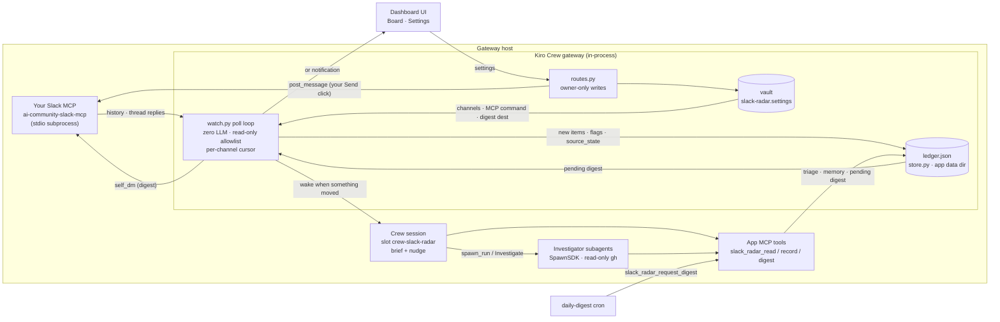
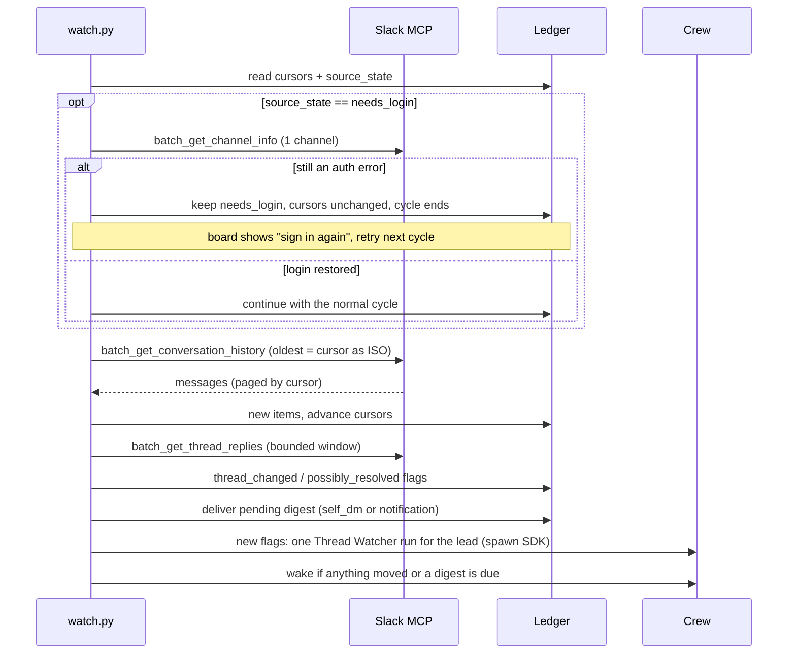
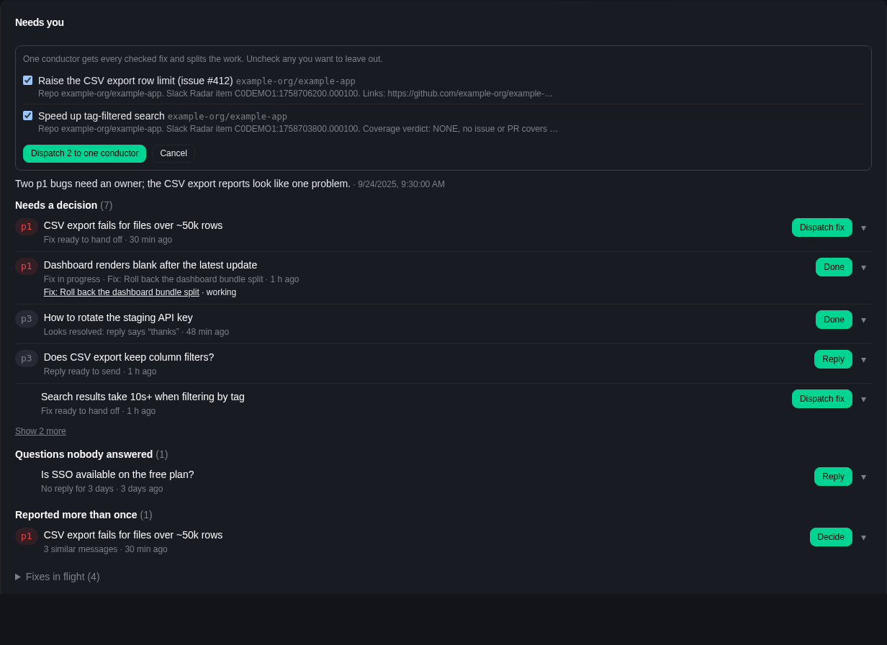
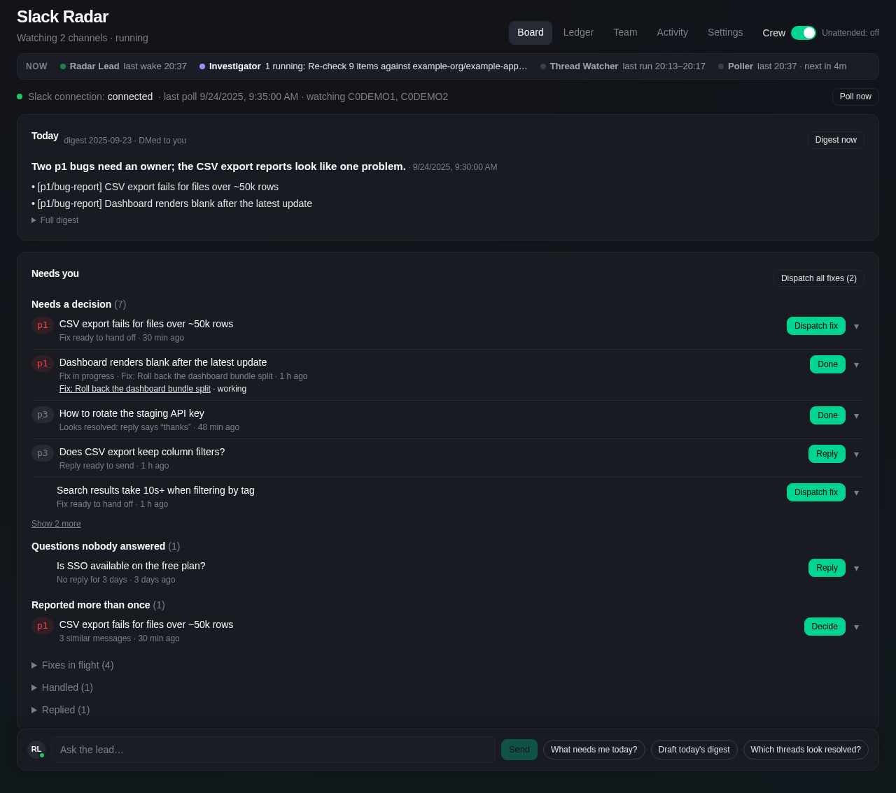
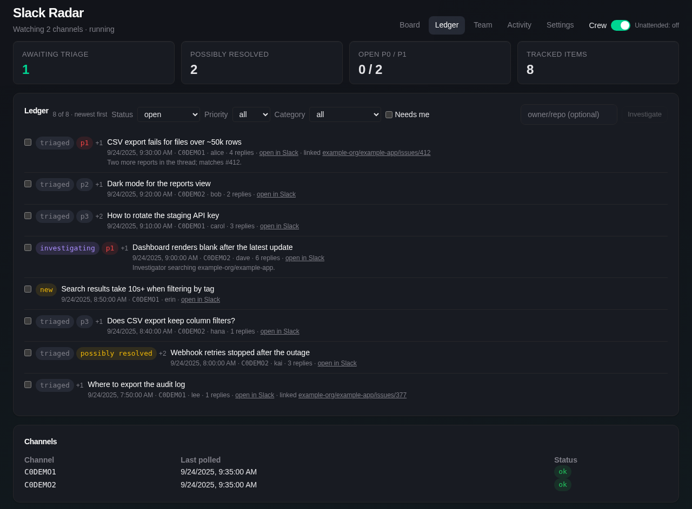
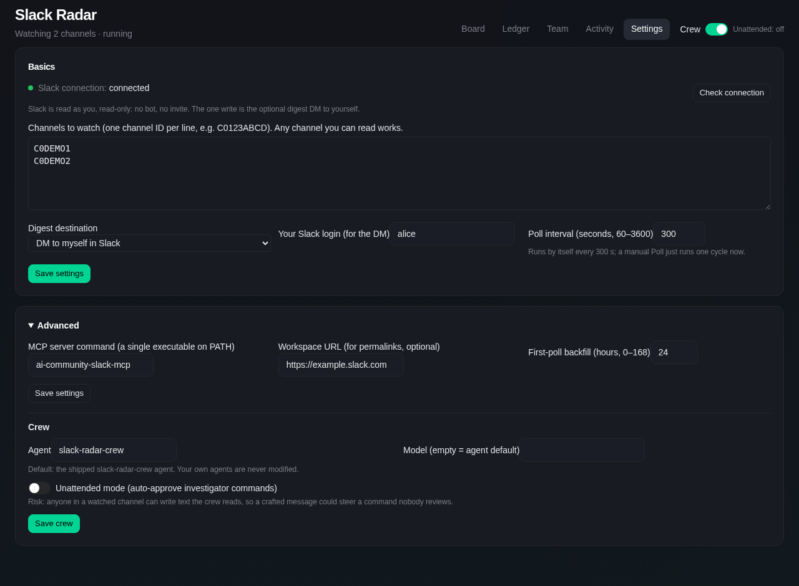
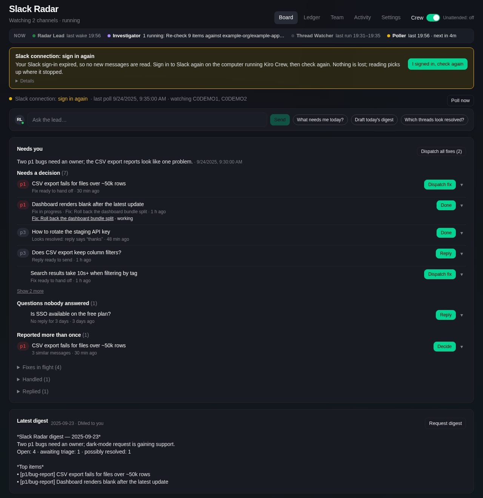
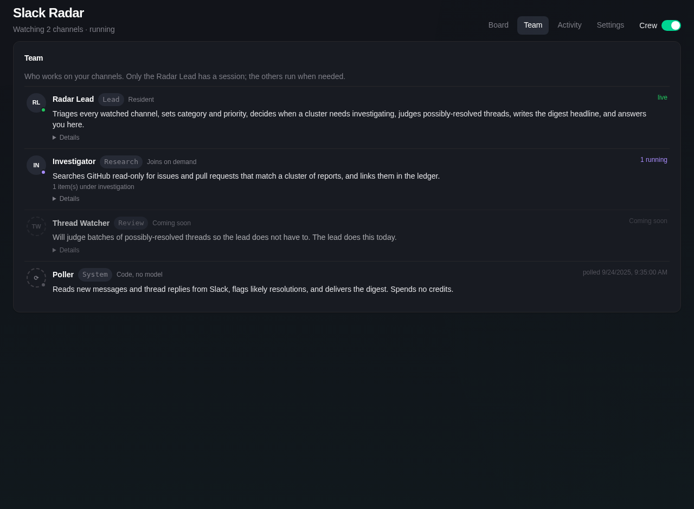
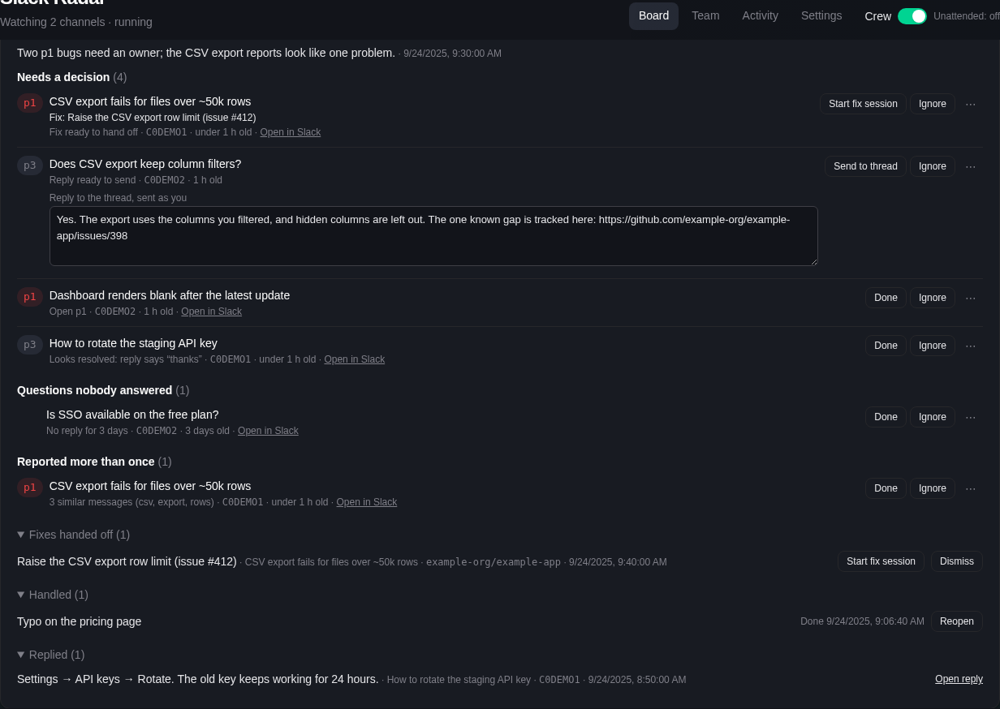
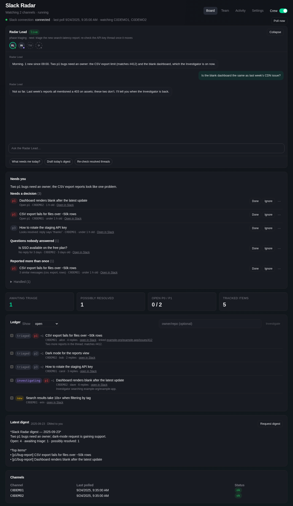

# Slack Radar

Slack Radar is a Slack triage crew that remembers. It reads Slack with your own
identity through your own Slack MCP server, so there is no bot to install, no
invite to send and nothing visible in the channel. One crew covers every channel
you choose: it classifies each new message as a bug report, feature request,
question, already-answered or noise, gives it a priority and a one-line summary,
links clusters of reports to existing GitHub issues and PRs, and notices when a
thread looks resolved. Everything it learns lives in a local ledger, so nothing
is triaged twice, and a daily digest tells you what mattered. It is modeled on
KiroCrew's built-in Issue Radar app.

[中文说明](#slack-radar-中文)

## How a message is triaged

1. **Poll.** An in-gateway loop (no model) asks your Slack MCP for everything
   newer than the app's own per-channel cursor, one batched call for all
   channels. Your Slack read state is never touched.
2. **Ledger.** New messages are written to the local ledger as items awaiting
   triage, with credential-shaped strings redacted, and the cursors advance.
3. **Radar Lead classifies.** If anything moved, the poller wakes the crew. The
   Radar Lead reads the ledger and sets category, priority and a summary on each
   new item, and decides which items form a cluster.
4. **Investigator links issues and PRs.** For a cluster, the lead spawns the
   read-only Investigator, which runs `gh search` and records matching issue
   and PR links on the items. You can also select items on the Ledger tab and
   press **Investigate**.
5. **Thread re-check.** Each cycle the poller re-reads a bounded window of open
   threads and flags *possibly resolved* ones (a ✅ reaction, a "fixed",
   "merged" or "thanks" reply, a deleted parent). Code never closes an item.
   After a poll that leaves new flags, one Thread Watcher run judges them all
   for the lead and records resolved or not.
6. **Digest.** When a digest is requested, the lead picks the top items and
   writes a headline. The gateway renders the text from the ledger and delivers
   it as a DM to yourself or as a dashboard notification, and keeps the text as
   the Board's last digest. The `daily-digest` cron asks for one every weekday at
   16:00 UTC.
7. **Today.** Whenever a turn changed anything, the lead also writes one public
   sentence for the Board: what changed and what needs you, or "nothing needs
   you".

### Architecture


```mermaid
flowchart LR
  subgraph host["Gateway host"]
    MCP["Your Slack MCP<br/>ai-community-slack-mcp<br/>(stdio subprocess)"]
    subgraph gw["Kiro Crew gateway (in-process)"]
      W["watch.py poll loop<br/>zero LLM · read-only allowlist<br/>per-channel cursor"]
      L[("ledger.json<br/>store.py · app data dir")]
      R["routes.py<br/>owner-only writes"]
      V[("vault<br/>slack-radar.settings")]
    end
    C["Crew session<br/>slot crew-slack-radar<br/>brief + nudge"]
    I["Investigator subagents<br/>SpawnSDK · read-only gh"]
    T["App MCP tools<br/>slack_radar_read / record / digest"]
  end
  UI["Dashboard UI<br/>Board · Settings"]
  MCP -- "history · thread replies" --> W
  W -- "new items · flags · source_state" --> L
  W -- "wake when something moved" --> C
  C -- "spawn_run / Investigate" --> I
  C --> T
  I --> T
  T -- "triage · memory · pending digest" --> L
  L -- "pending digest" --> W
  W -- "self_dm (digest)" --> MCP
  R -- "post_message (your Send click)" --> MCP
  W -- "or notification" --> UI
  UI -- "settings" --> R --> V
  V -- "channels · MCP command · digest dest" --> W
  CRON["daily-digest cron"] -- "slack_radar_request_digest" --> T
```

One poll cycle:


```mermaid
sequenceDiagram
  participant W as watch.py
  participant M as Slack MCP
  participant L as Ledger
  participant C as Crew
  W->>L: read cursors + source_state
  opt source_state == needs_login
    W->>M: batch_get_channel_info (1 channel)
    alt still an auth error
      W->>L: keep needs_login, cursors unchanged, cycle ends
      Note over W,L: board shows "sign in again", retry next cycle
    else login restored
      W->>L: continue with the normal cycle
    end
  end
  W->>M: batch_get_conversation_history (oldest = cursor as ISO)
  M-->>W: messages (paged by cursor)
  W->>L: new items, advance cursors
  W->>M: batch_get_thread_replies (bounded window)
  W->>L: thread_changed / possibly_resolved flags
  W->>L: deliver pending digest (self_dm or notification)
  W->>C: new flags: one Thread Watcher run for the lead (spawn SDK)
  W->>C: wake if anything moved or a digest is due
```

An auth error at any read in the cycle takes the `needs_login` branch before any
cursor moves.

## Requirements

- KiroCrew 0.8 or newer.
- A Slack MCP server installed and logged in on the gateway host. The default
  command is `ai-community-slack-mcp` on `PATH`; any server exposing the same
  read tools works (`list_channels`, `batch_get_conversation_history`,
  `batch_get_thread_replies`, `batch_get_channel_info`, `batch_get_user_info`,
  plus `self_dm` if you want the digest as a DM).
- Python 3.10 or newer.
- Optional: `gh`, logged in, for the Investigator's GitHub searches.

## Install

```bash
kirocrew app install /path/to/slack-radar
```

`kirocrew app install` takes the local directory that contains `app.json`.

The app ships a Python backend and two agents, so KiroCrew asks you to trust it
before any of that code runs. For a CLI install, grant it yourself, then enable
the app:

```bash
kirocrew config set agent.apps_trusted '["slack-radar"]'
kirocrew config set agent.apps_trusted_local '["slack-radar"]'
kirocrew app enable slack-radar
```

`config set` replaces the whole list. If `kirocrew config get agent.apps_trusted`
already names other apps, keep them in the list. The app is off by default
(`defaultEnabled: false`).

To pick up a newer version, re-run `kirocrew app install` on the updated
directory, then use **Library → ⋮ → Sync** on the app so the gateway re-renders
its agent specs. After an update the Lead's session restarts itself on the next poll.

## First run

1. Open **Slack Radar → Settings**.
2. **Slack sign-in.** Under **Basics**, press **Check connection**; the status line should read *Slack connection: connected*. The Slack MCP command (default `ai-community-slack-mcp`, a single executable on `PATH`, no arguments) and the optional workspace URL (`https://yourteam.slack.com`, so permalinks open directly) are under **Advanced**.
3. **Channels.** List the channel IDs to watch, one per line (right-click a
   channel → *Copy link*, the `C…` segment). Any channel you can read works,
   up to 50.
4. **Digest destination.** *Dashboard notification only* (the default) or *DM
   to myself* (`self_dm`, which needs your Slack login). Save settings.
5. **Turn on the Crew switch** in the page header. The line under the title then reads *Watching N channels · running*. The first poll backfills the last 24 hours (configurable under Advanced).

Nothing is polled until at least one channel is set, and the crew never runs
until you start it.

## Usage

The page has five tabs. The header shows the tabs, a **Crew** switch (start or pause the crew), *Unattended: on* or *off* beside it (whether the crew's commands run without asking you), and a status line such as *Watching 2 channels · running*. When the Slack sign-in expires, a full-width banner at the top says *Slack connection: sign in again*, with a **Details** fold for the technical error.

| Tab | What it shows |
|---|---|
| Board | Top to bottom. Under the Now strip, one thin line: Slack connection, last poll and **Poll now**. Then **Today**: the Lead's one-line summary as the heading, the latest digest's top items under it (**Full digest** unfolds the whole text), the digest date and **Digest now** in the card header; with no digest yet it reads *No digest yet* plus the button. Then **Needs you**, built by fixed rules from the ledger, no model call: *Needs a decision* (a fix ready to hand off, open p0/p1, finished investigations with GitHub links, threads that look resolved), *Questions nobody answered* (no reply for over 2 days) and *Reported more than once* (similar messages in one channel). Each group is sorted by priority (p0 first), then newest first, and shows 5 rows; **Show N more** opens the rest. A row shows the priority, the summary, why it is there and how long ago it was posted, and ONE button that names the next step: **Dispatch fix** (a fix is ready), **Reply** (a draft is ready, or the question is unanswered: it opens the thread in Slack), **Done** (it looks resolved, or its fix is in progress) or **Decide** (it opens the row). The **▾** toggle opens the row: channel, Slack link, the fix title or reply draft, and the other actions (*Done*, *Ignore*, *Why? Ask the lead*). Done and Ignore only take a row off this list; its status is unchanged. **Fixes in flight (N)** lists every dispatched fix with its session, its state, its PR once there is one, and **Dismiss**. **Handled (N)** lists what you took off, each with **Reopen**. Last, pinned to the bottom of the Board: **Ask the lead…**, one line with three quick questions (*What needs me today?*, *Draft today's digest*, *Which threads look resolved?*); your first question opens it upward into the full Radar Lead chat, which stays open (also after a reload) until you press **Collapse**. The Lead's avatar dot shows when it is working |
| Ledger | Every ledger item, newest first, with how long ago it was posted and at most two tags per row. Filters: **Status** (asks the server), **Priority**, **Category** and **Needs me** (a reply draft, a fix hand-off or a thread that looks resolved). Above it the counts; below it per-channel poll health. Tick items and press **Investigate** (optionally naming an `owner/name` repo) to spawn the Investigator on them |
| Team | Who is on the crew: Radar Lead (*Resident*), Investigator (*Joins on demand*), Thread Watcher (*Joins after a poll*) and the Poller (code, no model), each with a live status and its last run (*idle since 15:54 · last run 15:49–15:54*, *never ran*). Agent ids are in a **Details** fold |
| Activity | The work log: polls that moved something, login lost or restored, crew notes, digests, settings changes, crew session moves |
| Settings | **Basics** first: Slack connection check, watched channels, digest destination (plus your Slack login for a DM), poll interval (with the note *runs by itself every N s; a manual Poll just runs one cycle now*). **Advanced** (folded): Slack MCP command, workspace URL, backfill, and the crew agent, model and the *Unattended mode (auto-approve investigator commands)* switch |

On the Board, a one-line **Now** strip under the header shows each member and what it is doing (a pulsing dot while it works, e.g. *Investigator 1 running: re-checking 9 items*), or when it last ran: *Poller last 16:54 · next in 3m*, *Radar Lead last wake 16:55*, *Investigator last run 15:49–15:54*, *Thread Watcher last run --* before its first run. It refreshes every 5 seconds while anyone works, the Team tab shows the same status, the open chat shows *Investigator running · <task> · 3m* until the result arrives, and a click on the Investigator or Watcher opens their Activity lines.

A digest arrives every weekday at 16:00 UTC from the `daily-digest` cron, which
is on by default. To get one now, press **Digest now** on the Board. To stop
the daily one, pause the cron in the Schedule view.

**Existing installs** (before this default changed): updating the app keeps your
`daily-digest` job as it was, paused. The gateway only adds an app cron that does
not exist yet. Either resume `daily-digest` in the Schedule view, or disable and
re-enable the app (disabling removes the app's cron jobs, enabling adds them back
with the new default).

### Getting a fix started

When an investigation finds a concrete fix (a linked issue with a known cause, or a PR to backport), the Radar Lead writes one hand-off on the item: a self-contained task for a coding session with the repo, the item key, the links, the coverage verdict, what to change, how to verify, and "Do not merge; open a PR for review". The row shows up under *Needs a decision* as "Fix ready to hand off". Press **Dispatch fix**: that one click is your go-ahead, and there is no second dialog. Slack Radar opens a new `kirocrew-conductor` session in your sidebar (under *Slack Radar › fixes*, titled `Fix: <title>`) and sends it the task plus the Slack messages behind it (text, replies, links), marked as untrusted data. Its acceptance is "open a PR with CI green, do not merge, report the PR URL". A toast links the session. The row then reads "Fix in progress" with the session and whether it is working; once the conductor reports a PR, the row leaves *Needs a decision* and **Fixes in flight (N)** shows `PR #n`. The session is yours: read it, steer it, close it. Slack Radar never dispatches on its own, the Lead never dispatches, and the app writes nothing to Slack or GitHub. If you ask the Lead to do dev work, it answers with a hand-off instead. On a Kiro Crew whose gateway gives apps no session create, the button starts the conductor chat through the SDK's chat launcher instead (not tracked); with no launcher, it shows the task with **Copy task** and a **New chat** link.

With two or more fixes waiting, press **Dispatch all fixes (N)** in the card header to send them together. A list opens right in the card, every fix checked, with its repo and the start of its task. Uncheck any you want to keep back, then press **Dispatch N to one conductor**: that one click is your go-ahead for the whole list. Slack Radar opens ONE `kirocrew-conductor` session titled `Fix batch: N problems (<repo>)` with one section per fix, and the conductor splits the work itself. It opens one PR per fix (or one PR for fixes that touch the same code) and reports them as `PR: <url> fix <n>` lines, which land on the matching rows. **Fixes in flight** groups the batch under one header with `N PRs found / N`. One repo per batch, at most 10 fixes. Replies are still sent one by one.



### Reply in one click

When a question has a clear answer in the ledger or its links, or a bug report deserves an acknowledgement with the linked issue or PR, the Radar Lead drafts a short reply in the poster's language. The row shows up under *Needs a decision* as "Reply ready to send" with a **Reply** button. **Reply** opens the draft in an editable box; press **Send to thread** and it goes out in that message's thread under your own name, through your Slack MCP; the row leaves the list and the item counts as done. The open row also has *Done without sending*, *Ignore* and *Why? Ask the lead*, and a link to Slack. **Replied (N)** under the list shows what you sent, with a link to each reply. The Lead never posts: nothing reaches Slack without your click, one send per item per minute, and sending waits while Slack needs you to sign in again.

## The team

| Member | Role | What they do | When it runs |
|---|---|---|---|
| Radar Lead | Lead · resident | The crew session itself (agent `slack-radar-crew`, slot `crew-slack-radar`). Triages each new item (category, priority, summary), decides clusters, writes the digest headline, and is the one you talk to. Leaves possibly-resolved threads to the Thread Watcher | Woken by the Poller when a poll moved something, a digest is due, or leftover work waits; and when you message it |
| Investigator | Research · leaf | Spawned per cluster (agent `slack-radar-investigator`). Runs read-only `gh search` / `gh issue view` / `gh pr view` and records matching issue and PR links on the items. Never writes to GitHub or Slack | When the lead spawns it for a cluster, or you press **Investigate** |
| Thread Watcher | Review · leaf | Dispatched for the lead (agent `slack-radar-watcher`). Judges every new possibly-resolved thread in one batch and records resolved or not in the ledger. Ledger only, no shell, never spawns | After a poll that flags possibly-resolved threads: one run per poll, never two at once, only while the crew is on |
| Poller | System · code, no model | Runs inside the gateway. Cursor reads, thread re-checks, login-expiry detection, and digest delivery. Wakes the lead only when something moved | By itself every `poll_interval_secs` (300 s); **Poll now** runs one extra cycle |

### Desk

The crew's rules and interfaces live in `desk/`. [desk/CHARTER.md](desk/CHARTER.md) is the charter: the roster, who dispatches whom (only the Radar Lead spawns), what may never be sent to Slack, public vs local data, unattended scope and stop conditions. [desk/CONTRACT.md](desk/CONTRACT.md) is the machine contract: fixed agent names, the ledger format, the MCP tools and the HTTP routes. [desk/members.json](desk/members.json) is the roster as data, and `GET /api/apps/slack-radar/org` returns it with each member's live status. `GET /api/apps/slack-radar/now` says what each member is doing right now (the Lead's phase, each running Investigator or Watcher task from the gateway's run list, the Poller's last and next poll) and when each one last ran, and the Activity log gets a line when an Investigator or Watcher starts or finishes.

## Configuration

Settings live in the gateway's encrypted vault (entry `slack-radar.settings`) and
are written only through the owner-gated Settings page.

| Key | Default | What it does |
|---|---|---|
| `slack_mcp_command` | `ai-community-slack-mcp` | The Slack MCP executable the gateway spawns. One executable, no arguments, no shell syntax |
| `channels` | `[]` | Channel IDs to watch (at most 50) |
| `digest_destination` | `dashboard` | `dashboard` (notification only) or `self_dm` (DM to yourself) |
| `slack_login` | your OS login, if it looks like a Slack login | Needed for `self_dm` |
| `workspace_url` | empty | `https://yourteam.slack.com`, used only to build permalinks |
| `poll_interval_secs` | `300` | Seconds between polls, 60–3600 |
| `backfill_hours` | `24` | How far back the first poll reads, 0–168 |
| `recheck_days` | `7` | How old a thread can be and still be re-checked, 1–30. No UI field |
| `recheck_max_per_cycle` | `20` | Threads re-checked per cycle, 0–50. No UI field |

The Crew part of **Settings → Advanced** writes the crew record (`crew.json` in the app data dir), not the
vault: `agent` (default `slack-radar-crew`; an override only, your own agents are
never modified), `model` (empty = the agent's default), and `unattended` (the
*Unattended mode* switch, off by default).

## What runs in the background

- **The poll loop.** Started by the app's `on_startup` hook as a gateway task and
  stopped on shutdown. It runs by itself every `poll_interval_secs` once at least
  one channel is set, and costs no model turns; **Poll now** runs one extra cycle
  and leaves the schedule alone. It wakes the crew only when a poll moved
  something or a digest is due, so an idle workspace costs nothing. After a
  poll that flags possibly-resolved threads it starts one Thread Watcher run for
  them, through the app spawn SDK.
- **The `daily-digest` cron.** On by default (`0 16 * * 1-5`, UTC). Each run
  calls `slack_radar_request_digest` once and stops; the Radar Lead composes the
  digest in its own session and the poller delivers it (default destination:
  dashboard notification).

Disabling the app stops the loop and revokes the crew's auto-approve grant.

## Autonomy and security

- **Slack is read-only unless you click Send.** The MCP client's `call` admits only
  five read tools (`list_channels`, `batch_get_conversation_history`,
  `batch_get_thread_replies`, `batch_get_channel_info`, `batch_get_user_info`); any
  other tool name, `post_message` included, raises before it reaches the process.
  There are two writes, each a separate method: `self_dm` for the digest, and
  `post_message` in a thread, called only by the owner-only route behind **Send to
  thread**. The crew drafts replies but has no tool that posts; no reactions, edits
  or new channel posts.
- **No shell on the lead.** The Radar Lead's agent has no `execute_bash` and no
  `fs_write`. Its only tools are the ledger tools, `spawn_run` / `spawn_status` /
  `spawn_list`, `fs_read`, `grep`, `glob` and `thinking`, and all of them are
  pre-approved, so the lead never prompts and never gains a tool, in either mode.
- **The Investigator has a shell, and unattended mode lets it run without asking.**
  When the Radar Lead spawns an Investigator with `spawn_run`,
  the crew's scoped grant reaches the child (Kiro Crew core since
  kirodotdev/KiroCrew#14497). While unattended mode is on, the spawn and every
  Investigator shell command are approved without a prompt, each one SEL-audited.
  While it is off, the host asks you to approve the spawn and then each command,
  and an unanswered prompt is denied after two hours.
- **The Ledger tab's Investigate button needs unattended mode.** It spawns through the
  app spawn SDK, which the host runs with every command auto-approved for the whole
  run. So the button is refused (`unattended_required`) while unattended mode is
  off.
- **The Thread Watcher runs without asking, in either mode.** The gateway starts it
  through the app spawn SDK after a poll flags possibly-resolved threads. Its only
  tool is the ledger, which is in its own `allowedTools`, so auto-approval covers
  nothing but recording verdicts.
- **Unattended mode is off by default.** When on and the crew is live, the
  crew's session holds a scoped, 15-minute, SEL-audited grant, never the
  interactive trust flag. Every poll renews it while the toggle is on, so the
  crew runs unattended continuously, not for a window. Each approval re-checks
  the grant, so a grant that lapses makes the next request ask again. Picking
  **Normal** in the chat's trust menu ends the grant only until the next poll
  arms it again; the app's own toggle is the off switch that lasts. Risk: Slack
  text anyone in a watched channel can write reaches an agent with a shell, so a
  crafted message could steer a command nobody reviews. Turn it on only when
  every watched channel is trusted. See
  [docs/unattended-mode.md](docs/unattended-mode.md) for the approval chain.
- **Prompt injection.** The crew reads text anyone in your channels can write.
  The ledger tools and the investigation prompt label message text as untrusted
  data, and both agents are told never to follow instructions in it. That is a mitigation,
  not a guarantee, which is why the lead has no shell and auto-approve is opt-in.
- **Token-free.** No Slack credential is stored. The Slack MCP authenticates with
  your own session.
- **Settings are authority.** They sit in the gateway vault, which agents can
  neither read nor write. Settings, MCP probe, start/pause, poll, digest and
  investigate routes are owner-only, so the crew cannot change what is read,
  which binary runs, or its own auto-approval.
- Credential-shaped strings in messages are redacted before they reach the
  ledger. The ledger is local, but other agents on this machine can read it.
  Because it reads with your identity, private channels you belong to can be
  watched too.

## Troubleshooting

- **The page says *Slack connection: sign in again*.** Your Slack MCP's login expired. Log in to
  the Slack MCP again on the gateway host, then press **I signed in, check again**. Polling stays paused with cursors
  unchanged and resumes on the next cycle after a read succeeds; an expired login
  is never reported as "no new messages".
- **The crew says its ledger tools are "not granted" or missing.** Its agent spec
  is stale, usually after an update. Run **Library → ⋮ → Sync** on Slack Radar,
  then turn the **Crew** switch on again.
- **The crew's session moved to `crew-slack-radar-g2`.** Expected. When the
  existing slot is bound to a different agent (for example one created by an
  older version on `kirocrew`), the app archives it and opens a fresh slot with a
  generation suffix. The Activity tab logs the move. Use the newest session.
- **Status reads *Slack connection: not installed* or *missing read access*.**
  The Slack MCP command is not on the gateway's `PATH`, or that server does not
  expose the five read tools listed above.

## Development

```bash
python3 -m pytest tests -q          # MCP guard, ts<->ISO, poll cycle, needs-login, digest, ledger tools, slot moves
python3 -m json.tool app.json > /dev/null && for f in agents/*.json; do python3 -m json.tool "$f" > /dev/null; done
cd ui && npm install --legacy-peer-deps && npx vite build   # rebuilds ui/dist/index.mjs
KIROCREW_WEBSITE=/path/to/KiroCrew/website node docs/screenshots/capture/shoot.mjs   # regenerate screenshots from fake data
```

The UI bundle `ui/dist/index.mjs` is committed so a plain install works without
a Node toolchain.

## Repository layout

```
slack-radar/
├── app.json                    manifest
├── agents/slack-radar-crew.json          the Radar Lead's agent (ledger tools, no shell)
├── agents/slack-radar-investigator.json   read-only GitHub investigator
├── backend/
│   ├── routes.py               HTTP API (backend.hooks.routes)
│   ├── hooks.py                on_startup / on_shutdown: poll loop, grant revoke
│   ├── watch.py                poll cycle, thread re-check, ts<->ISO, digest render/deliver
│   ├── slack_mcp.py            stdio client for your Slack MCP, read-only allowlist + self_dm + post_reply
│   ├── settings.py             vault-backed settings
│   ├── crew_runtime.py         crew session, brief injection, nudge, grant, slot moves
│   ├── store.py                ledger (stdlib only, shared with the MCP server)
│   ├── mcp_server.py           crew tools: slack_radar_read/record/digest/request_digest
│   ├── crew_brief.md           the crew's standing instructions
│   ├── org.py                  desk/members.json loader and the GET /org view
│   ├── needs.py                the Needs-you rules behind GET /needs (no model call)
│   └── crew_ledger_spec.md     pointer to desk/CONTRACT.md
├── desk/                       CHARTER.md, CONTRACT.md (ledger fields, tools, routes), members.json
├── docs/screenshots/           screenshots and the fake-data capture harness
├── ui/                         React page (Board / Ledger / Team / Activity / Settings)
└── tests/                      test_slack_radar.py, test_org.py, test_needs.py
```

## Screenshots

Rendered from fake demo data (`docs/screenshots/capture/`); no real Slack content.

| | |
|---|---|
|  |  |
| Board: the Now strip, **Today** (the Lead's line and the digest's top items), **Needs you** (5 rows per group, one button each) and the one-line *Ask the lead* bar pinned at the bottom | Ledger: every item newest first, with Status, Priority, Category and Needs me filters, **Investigate**, counts and channel health |
|  | |
| Settings: Basics (connection, channels, digest, poll interval) and the opened Advanced section | |
|  |  |
| Sign-in expired: a banner says so and polling pauses, instead of an empty queue | Team: who is on the crew and what each one is doing |
|  |  |
| Needs you: one button per row (**Dispatch fix**, **Done**, **Reply**), a dispatched fix in progress, a reply row opened with its editable draft and **Send to thread**, **Show 2 more**, and the opened **Fixes in flight**, **Replied** and **Handled** folds | After the first question the lead chat opens upward from the bottom of the Board; **Collapse** folds it back to one line |

## License

MIT, as declared in `app.json`.

---

<a id="slack-radar-中文"></a>

# Slack Radar（中文）

Slack Radar 是一个“有记性”的 Slack 分诊小组。它通过你自己的 Slack MCP
服务器、用你自己的身份读取 Slack：不用装机器人，不用邀请谁进频道，频道里也看不出任何痕迹。
一个小组负责你选定的所有频道：把每条新消息归为 bug 报告、功能需求、提问、已有答复或噪音，
标上优先级并写一句话摘要；把同类报告聚成一簇，关联到已有的 GitHub issue 和 PR；
还会留意哪些线程看起来已经解决。所有结论都记在本地台账里，同一条消息不会被分诊两次；
每天一份摘要告诉你哪些事值得看。它的设计参照了 KiroCrew 内置的 Issue Radar 应用。

## 一条消息是怎么被分诊的

1. **轮询。** 网关内的一个循环（不调用模型）向你的 Slack MCP 请求比本应用自己的
   频道游标更新的所有消息，所有频道合并成一次批量调用。你在 Slack 里的已读状态不会被改动。
2. **台账。** 新消息作为“待分诊”条目写入本地台账，像凭据的字符串会先被打码，然后游标前移。
3. **雷达组长分类。** 只要有变化，轮询器就唤醒小组。雷达组长读取台账，为每条新条目定类别、
   优先级和摘要，并决定哪些条目归为一簇。
4. **调查员关联 issue 和 PR。** 对于一簇报告，组长会派出只读的调查员，用 `gh search`
   查找并把匹配的 issue、PR 链接记到条目上。你也可以在 Ledger（台账）标签页勾选条目后点 **Investigate**。
5. **线程复查。** 每一轮，轮询器会在有限的窗口内重读仍打开的线程，把“可能已解决”的标出来
   （✅ 表情、“fixed”“merged”“thanks”之类的回复、原消息被删除）。代码从不自行关闭条目。
   一次轮询留下新标记后，由一次线程观察员运行替组长统一判断，并记下是否已解决。
6. **摘要。** 请求摘要时，组长挑出最重要的条目并写一句标题；网关从台账渲染出正文，
   以私信发给你自己，或作为仪表盘通知送达，并把正文留作看板上的“最近一次摘要”。
   `daily-digest` 定时任务每个工作日 UTC 16:00 请求一份。
7. **今日一句。** 只要一轮工作有变化，组长还会为看板写一句公开的话：变了什么、哪里需要你，
   或者“没有需要你的事”。

架构图和单轮轮询的时序图见英文部分的 [Architecture](#architecture)，这里不再重复。

## 环境要求

- KiroCrew 0.8 或更新版本。
- 网关所在主机上已安装并登录好一个 Slack MCP 服务器。默认命令是 `PATH` 上的
  `ai-community-slack-mcp`；只要提供同样的读取工具（`list_channels`、
  `batch_get_conversation_history`、`batch_get_thread_replies`、
  `batch_get_channel_info`、`batch_get_user_info`，想用私信收摘要还需要 `self_dm`），
  其他服务器也可以。
- Python 3.10 或更新版本。
- 可选：已登录的 `gh`，供调查员搜索 GitHub。

## 安装

```bash
kirocrew app install /path/to/slack-radar
```

`kirocrew app install` 接收包含 `app.json` 的本地目录。

本应用带有 Python 后端和两个 agent，所以 KiroCrew 会先要求你信任它，然后才会运行这些代码。
用命令行安装时，需要自己授予信任，再启用应用：

```bash
kirocrew config set agent.apps_trusted '["slack-radar"]'
kirocrew config set agent.apps_trusted_local '["slack-radar"]'
kirocrew app enable slack-radar
```

`config set` 会整体替换列表。如果 `kirocrew config get agent.apps_trusted`
里已经有别的应用，记得一并保留。应用默认不启用（`defaultEnabled: false`）。

升级时，对更新后的目录重新执行 `kirocrew app install`，然后在
**Library → ⋮ → Sync** 里同步本应用，让网关重新生成它的 agent 配置。升级后，Lead 的会话会在下一次轮询时自动重启。

## 首次运行

1. 打开 **Slack Radar → Settings**。
2. **Slack 登录。** 在 **Basics** 里点 **Check connection**，状态行应显示 *Slack connection: connected*。Slack MCP 命令（默认 `ai-community-slack-mcp`，`PATH` 上的单个可执行文件，不带参数）和可选的工作区地址（`https://yourteam.slack.com`，让消息链接能直接打开）在 **Advanced** 里。
3. **频道。** 每行一个要监听的频道 ID（右键频道 → *Copy link*，取其中 `C…` 那一段）。
   只要你能读的频道都行，最多 50 个。
4. **摘要去向。** *Dashboard notification only*（默认，仅仪表盘通知）或
   *DM to myself*（`self_dm`，需要填你的 Slack 登录名）。保存设置。
5. **打开页头的 Crew 开关。** 标题下的状态行会变成 *Watching N channels · running*。第一次轮询会回溯最近 24 小时（可在 Advanced 里调）。

在设置至少一个频道之前不会轮询；在你点启动之前，小组也不会运行。

## 使用

页面有五个标签页。页头放着标签页、一个 **Crew** 开关（启动或暂停小组）、旁边的 *Unattended: on* 或 *off*（小组的命令是否无需你确认就运行）和一行状态，例如 *Watching 2 channels · running*。Slack 登录过期时，页面顶部会出现一条通栏横幅 *Slack connection: sign in again*，技术细节收在 **Details** 折叠里。

| 标签页 | 内容 |
|---|---|
| Board（看板） | 从上到下。Now 条下面是细细的一行：Slack 连接、最近一次轮询和 **Poll now**。接着是 **Today（今天）**：组长的一句话总结做标题，下面是最近一份摘要的要点（**Full digest** 展开全文），卡片标题栏里是摘要日期和 **Digest now**；还没有摘要时只显示 *No digest yet* 和这个按钮。然后是 **Needs you（需要你处理）**，按固定规则从台账算出，不调用模型：*Needs a decision*（可以交接的修复、未关闭的 p0/p1、带 GitHub 链接且已查完的调查、看起来已解决的线程）、*Questions nobody answered*（超过 2 天没人回的问题）和 *Reported more than once*（同一频道里相似的消息）。每组先按优先级排（p0 在前），同一优先级里新的在前，只显示 5 行；**Show N more** 展开其余的。每行显示优先级、摘要、为什么在这里、发了多久，以及唯一一个写明下一步的按钮：**Dispatch fix**（修复已就绪）、**Reply**（回复草稿已就绪；或问题没人回，这时它打开 Slack 里的线程）、**Done**（看起来已解决，或修复正在进行）或 **Decide**（展开这一行）。**▾** 展开这一行：频道、Slack 链接、修复标题或回复草稿，以及其他操作（*Done*、*Ignore*、*Why? Ask the lead*）。Done 和 Ignore 只是把它移出这个列表，状态不变。**Fixes in flight (N)** 列出所有已派发的修复，带会话、状态、有了之后的 PR，以及 **Dismiss**。**Handled (N)** 列出你移走的条目，每条可 **Reopen**。最后，固定在看板底部：**Ask the lead…**，一行输入框加三个快捷问题（*What needs me today?*、*Draft today's digest*、*Which threads look resolved?*）；问出第一个问题后，它向上展开成完整的雷达组长聊天，一直开着（刷新后也是），直到你点 **Collapse**。组长头像上的圆点显示它是否在工作 |
| Ledger（台账） | 台账里的所有条目，新的在前，显示发了多久，每行最多两个标签。筛选：**Status**（由服务器筛）、**Priority**、**Category** 和 **Needs me**（有回复草稿、修复交接，或线程看起来已解决）。上面是计数，下面是各频道轮询健康度。勾选条目后点 **Investigate**（可选填一个 `owner/name` 仓库）即可派调查员去查 |
| Team（团队） | 小组成员：雷达组长（*Resident*，常驻）、调查员（*Joins on demand*，按需加入）、线程观察员（*Joins after a poll*，轮询后加入）和轮询器（代码，不用模型），各带实时状态和上次运行时间（*idle since 15:54 · last run 15:49–15:54*、*never ran*）。agent id 收在 **Details** 折叠里 |
| Activity（动态） | 工作日志：有变化的轮询、登录失效与恢复、小组备注、摘要、设置变更、小组会话迁移 |
| Settings（设置） | 先是 **Basics**：Slack 连接检查、监听的频道、摘要去向（选私信时还有 Slack 登录名）、轮询间隔（旁边注明 *runs by itself every N s; a manual Poll just runs one cycle now*：它自己定时跑，手动 Poll 只是立刻多跑一轮）。**Advanced**（默认折叠）：Slack MCP 命令、工作区地址、回溯时长，以及小组的 agent、模型和 *Unattended mode (auto-approve investigator commands)* 开关 |

看板页头下有一行 **Now**，显示每个成员此刻在做什么（工作时圆点会闪，例如 *Investigator 1 running: re-checking 9 items*），或者上次什么时候运行：*Poller last 16:54 · next in 3m*、*Radar Lead last wake 16:55*、*Investigator last run 15:49–15:54*，第一次运行之前是 *Thread Watcher last run --*。有人在工作时每 5 秒刷新一次，Team 标签页显示同样的状态，展开的聊天在结果回来之前显示 *Investigator running · <任务> · 3m*，点调查员或线程观察员会打开他们的 Activity 记录。

`daily-digest` 定时任务默认开启，每个工作日 UTC 16:00 送来一份摘要。想马上要一份，点看板上的
**Digest now**；不想要每日摘要，就在 Schedule 页面暂停这个任务。

**已安装的旧版本**（默认值改变之前装的）：更新应用不会改动你已有的 `daily-digest` 任务，它仍是暂停的，
因为网关只添加尚不存在的应用定时任务。要么在 Schedule 页面恢复 `daily-digest`，要么停用再启用应用
（停用会删除应用的定时任务，启用时按新的默认值重新添加）。

### 开始一个修复

调查找到明确的修复时（一个原因已知的关联 issue，或一个要回移的 PR），雷达组长会在条目上写一个交接：给编码会话的自包含任务，含仓库、条目 key、链接、覆盖结论、改什么、怎么验证，以及 "Do not merge; open a PR for review"。这一行会出现在 *Needs a decision* 里，原因是 "Fix ready to hand off"。点 **Dispatch fix**：这一下就是你的同意，不会再弹第二个对话框。Slack Radar 会在侧边栏开一个新的 `kirocrew-conductor` 会话（在 *Slack Radar › fixes* 下，标题 `Fix: <标题>`），把任务和背后的 Slack 消息（原文、回复、链接）作为不可信数据发给它。验收条件是“开一个 CI 全绿的 PR，不合并，报告 PR 链接”。一个提示条会链接到这个会话。之后这一行显示 "Fix in progress"、会话和它是否在工作；conductor 报告 PR 后，这一行离开 *Needs a decision*，**Fixes in flight (N)** 里显示 `PR #n`。这个会话是你的：可以读、引导、关闭。Slack Radar 从不自己派发，组长也从不派发，应用不向 Slack 或 GitHub 写任何东西。你让组长做开发工作时，它会用一个交接来回答。如果网关不允许应用创建会话，按钮会改用 SDK 聊天启动器开 conductor 聊天（不跟踪）；没有启动器时，会显示任务，带 **Copy task** 和 **New chat** 链接。

有两个或以上修复待派发时，点卡片标题旁的 **Dispatch all fixes (N)** 一起发出。卡片里会直接展开一个清单，每个修复都已勾选，显示仓库和任务开头。取消你想留下的，再点 **Dispatch N to one conductor**：这一下就是你对整张清单的同意。Slack Radar 只开一个 `kirocrew-conductor` 会话，标题 `Fix batch: N problems (<仓库>)`，每个修复一节，由 conductor 自己拆分工作。它每个修复开一个 PR（改同一处代码的修复合成一个 PR），用 `PR: <url> fix <n>` 行报告，这些 PR 会落到对应的行上。**Fixes in flight** 把这一批放在一个标题下，显示 `N PRs found / N`。每批只能一个仓库，最多 10 个修复。回复仍然一条条发送。


### 一键回复

当一个问题在台账或链接里已有明确答案，或一个 bug 报告值得回一句并附上关联的 issue 或 PR 时，雷达组长会用发帖人的语言起草一条简短的回复。这一行会出现在 *Needs a decision* 里，原因是 "Reply ready to send"，按钮是 **Reply**。点 **Reply** 会在可编辑的输入框里打开草稿；再点 **Send to thread**，它就以你自己的名义、通过你的 Slack MCP 发到那条消息的线程里；这一行离开列表，条目算作已完成。展开的行里还有 *Done without sending*、*Ignore*、*Why? Ask the lead* 和 Slack 链接。列表下面的 **Replied (N)** 显示你发过的回复，每条带链接。组长从不发消息：没有你的点击，什么都不会到达 Slack；每个条目每分钟最多发一次；Slack 需要重新登录时不能发送。

## 团队

| 成员 | 角色 | 职责 | 什么时候运行 |
|---|---|---|---|
| 雷达组长 | 组长 · 常驻 | 就是小组会话本身（agent `slack-radar-crew`，槽位 `crew-slack-radar`）。给每条新条目分诊（类别、优先级、摘要），决定如何聚簇，写摘要标题，也是你对话的对象。“可能已解决”的线程交给线程观察员 | 轮询有变化、摘要到期或有遗留工作时由轮询器唤醒；你给它发消息时 |
| 调查员 | 调研 · 临时 | 每簇派一个（agent `slack-radar-investigator`）。只读地运行 `gh search` / `gh issue view` / `gh pr view`，把匹配的 issue、PR 链接记到条目上。从不写 GitHub 或 Slack | 组长为一簇派它，或你点 **Investigate** 时 |
| 线程观察员 | 复核 · 临时 | 替组长派出（agent `slack-radar-watcher`）。一批判断所有新的“可能已解决”线程，把是否已解决记到台账上。只有台账，没有 shell，从不派生 | 轮询标出“可能已解决”的线程之后：每次轮询一次，同时最多一个，只在小组运行时 |
| 轮询器 | 系统 · 代码，不用模型 | 运行在网关内。负责游标读取、线程复查、登录失效检测和摘要投递；只有真有变化时才唤醒组长 | 每隔 `poll_interval_secs`（300 秒）自己跑一次；**Poll now** 立刻多跑一轮 |

### Desk（工作台）

小组的规则和接口放在 `desk/` 里。[desk/CHARTER.md](desk/CHARTER.md) 是章程：成员、谁派谁（只有雷达组长会派生）、绝不能发到 Slack 的东西、公开与本地数据、无人值守的范围和停止条件。[desk/CONTRACT.md](desk/CONTRACT.md) 是机器契约：固定的 agent 名字、台账格式、MCP 工具和 HTTP 接口。[desk/members.json](desk/members.json) 是成员名单的数据形式，`GET /api/apps/slack-radar/org` 返回它，并附上每个成员的实时状态。`GET /api/apps/slack-radar/now` 说明每个成员此刻在做什么（组长的阶段、网关运行列表里每个调查员或线程观察员的任务、轮询器上次和下次轮询的时间）以及每个成员上次运行的时间，调查员或线程观察员开始或结束时，Activity 日志也会记一行。

## 配置

设置保存在网关的加密保险库里（条目 `slack-radar.settings`），只能通过仅限所有者的设置页写入。

| 键 | 默认值 | 作用 |
|---|---|---|
| `slack_mcp_command` | `ai-community-slack-mcp` | 网关要启动的 Slack MCP 可执行文件。单个可执行文件，不带参数，不含 shell 语法 |
| `channels` | `[]` | 要监听的频道 ID（最多 50 个） |
| `digest_destination` | `dashboard` | `dashboard`（仅通知）或 `self_dm`（私信给自己） |
| `slack_login` | 你的系统登录名（格式像 Slack 登录名时） | `self_dm` 需要它 |
| `workspace_url` | 空 | `https://yourteam.slack.com`，只用来生成消息链接 |
| `poll_interval_secs` | `300` | 两次轮询间隔的秒数，60–3600 |
| `backfill_hours` | `24` | 首次轮询回溯的小时数，0–168 |
| `recheck_days` | `7` | 多久以内的线程仍会被复查（天），1–30。界面上没有对应字段 |
| `recheck_max_per_cycle` | `20` | 每轮最多复查的线程数，0–50。界面上没有对应字段 |

**Settings → Advanced** 里的 Crew 部分写入的是小组记录（应用数据目录下的 `crew.json`），而不是保险库：`agent`
（默认 `slack-radar-crew`；只是覆盖项，你自己的 agent 永远不会被修改）、`model`
（留空即用 agent 的默认模型）、`unattended`（*Unattended mode* 开关，默认关闭）。

## 后台会跑什么

- **轮询循环。** 由应用的 `on_startup` 钩子作为网关任务启动，关闭时停止。设置了至少一个频道后，
  每隔 `poll_interval_secs` 自己跑一次，不消耗模型调用；**Poll now** 只是立刻多跑一轮，不改变定时。
  只有轮询发现变化或到了该出摘要时才唤醒小组，所以工作区安静时不花任何成本。轮询标出“可能已解决”的线程后，
  它通过应用的派生 SDK 启动一次线程观察员运行来判断它们。
- **`daily-digest` 定时任务。** 随应用附带，默认开启（`0 16 * * 1-5`，UTC）。每次只调用一次
  `slack_radar_request_digest` 就结束；摘要由雷达组长在自己的会话里撰写，再由轮询器投递（默认去向：仪表盘通知）。

停用应用会停止轮询循环，并撤销小组的自动批准授权。

## 自主性与安全

- **除非你点发送，Slack 是只读的。** MCP 客户端的 `call` 只放行五个读取工具（`list_channels`、
  `batch_get_conversation_history`、`batch_get_thread_replies`、
  `batch_get_channel_info`、`batch_get_user_info`），其他工具名（包括 `post_message`）在到达进程前就会被拒绝。
  写操作有两个，各是单独的方法：摘要用的 `self_dm`，以及在线程里的 `post_message`，只由 **Send to thread**
  背后的仅限所有者接口调用。小组能起草回复，但没有任何能发消息的工具；不加表情、不编辑、不在频道发新消息。
- **组长没有 shell。** 雷达组长的 agent 没有 `execute_bash` 和 `fs_write`。它只有台账工具、
  `spawn_run` / `spawn_status` / `spawn_list`、`fs_read`、`grep`、`glob` 和 `thinking`，
  而且都已预先批准，所以无论哪种模式，组长都不会弹确认，也不会多出别的工具。
- **调查员有 shell，无人值守模式下它运行时不再询问你。** 雷达组长用 `spawn_run` 派出调查员时，
  小组的限定范围授权会传到子 agent（Kiro Crew 核心自 kirodotdev/KiroCrew#14497 起）。无人值守模式打开时，
  这次派出和调查员的每条 shell 命令都会自动批准，每条都记入 SEL 审计。模式关闭时，网关会先请你批准派出，
  再逐条批准命令，无人应答的确认两小时后自动拒绝。
- **Ledger 标签页的 Investigate 按钮需要无人值守模式。** 它通过应用的 spawn SDK 派出调查员，
  网关对这类派出在整个运行期间自动批准每条命令。所以无人值守模式关闭时，这个按钮会被拒绝
  （`unattended_required`）。
- **线程观察员在两种模式下都不询问。** 轮询标出“可能已解决”的线程后，网关通过应用的 spawn SDK
  启动它。它唯一的工具是台账，已在它自己的 `allowedTools` 里，所以自动批准只覆盖记录结论。
- **无人值守模式默认关闭。** 开启且小组在运行时，小组会话持有一个限定范围、15 分钟有效、记入 SEL 审计的授权，
  绝不是交互式的信任开关。只要开关开着，每次轮询都会续期，所以小组是持续无人值守运行，而不是只有一段时间。
  每次审批都会重新检查授权，授权过期后下一次请求会重新询问你。在聊天的信任菜单里选 **Normal** 只会结束授权到
  下一次轮询为止，下一次轮询会重新授权；应用自己的开关才是长期有效的关闭方式。风险：监听频道里任何人都能写的
  Slack 文字会到达一个有 shell 的 agent，精心构造的消息可能引导一条没人审核的命令。只有当所有监听频道都可信时
  才建议开启。审批链的细节见 [docs/unattended-mode.md](docs/unattended-mode.md)。
- **提示注入。** 小组读的是频道里任何人都能写的文字。台账工具和调查提示都把消息正文标为不可信数据，
  两个 agent 也都被要求绝不执行其中的指令。这只是缓解而非保证，所以组长不给 shell，自动批准也需要主动开启。
- **不存令牌。** 不保存任何 Slack 凭据，Slack MCP 用的是你自己的登录会话。
- **设置即权限。** 设置存放在网关保险库里，agent 既读不到也写不了。设置、MCP 探测、启动/暂停、
  轮询、摘要和调查等接口都仅限所有者调用，因此小组无法改变读取范围、要运行的程序，也无法给自己开自动批准。
- 消息里像凭据的字符串在写入台账前会被打码。台账存在本地，但本机上的其他 agent 可以读到。
  因为是用你的身份读取，你所在的私有频道也可以被监听。

## 排障

- **页面显示 *Slack connection: sign in again*。** 你的 Slack MCP 登录过期了。在网关主机上重新登录 Slack MCP，然后点 **I signed in, check again**。
  这期间轮询暂停、游标不动；下一轮读取成功后自动恢复。登录过期绝不会被当成“没有新消息”。
- **小组说台账工具“not granted”或找不到。** 它的 agent 配置过时了，通常发生在升级之后。
  在 **Library → ⋮ → Sync** 同步 Slack Radar，然后重新打开 **Crew** 开关。
- **小组会话迁到了 `crew-slack-radar-g2`。** 这是正常的。如果现有槽位绑定的是别的 agent
  （比如旧版本在 `kirocrew` 上建的），应用会把它归档，并新开一个带代数后缀的槽位。
  Activity 页会记录这次迁移；使用最新的那个会话即可。
- **状态显示 *Slack connection: not installed* 或 *missing read access*。** Slack MCP 命令不在网关的
  `PATH` 上，或者该服务器没有提供上面列出的五个读取工具。

## 开发

```bash
python3 -m pytest tests -q          # MCP 防护、ts<->ISO、轮询、needs-login、摘要、台账工具、槽位迁移
python3 -m json.tool app.json > /dev/null && for f in agents/*.json; do python3 -m json.tool "$f" > /dev/null; done
cd ui && npm install --legacy-peer-deps && npx vite build   # 重新构建 ui/dist/index.mjs
KIROCREW_WEBSITE=/path/to/KiroCrew/website node docs/screenshots/capture/shoot.mjs   # 用假数据重新生成截图
```

UI 产物 `ui/dist/index.mjs` 已提交到仓库，所以直接安装不需要 Node 工具链。

## 仓库结构

```
slack-radar/
├── app.json                    应用清单
├── agents/slack-radar-crew.json          雷达组长的 agent（台账工具，无 shell）
├── agents/slack-radar-investigator.json   只读的 GitHub 调查员
├── backend/
│   ├── routes.py               HTTP 接口（backend.hooks.routes）
│   ├── hooks.py                on_startup / on_shutdown：轮询循环、撤销授权
│   ├── watch.py                轮询、线程复查、ts<->ISO、摘要渲染与投递
│   ├── slack_mcp.py            连接你的 Slack MCP 的 stdio 客户端，只读白名单 + self_dm + post_reply
│   ├── settings.py             基于保险库的设置
│   ├── crew_runtime.py         小组会话、简报注入、唤醒、授权、槽位迁移
│   ├── store.py                台账（仅用标准库，与 MCP 服务器共用）
│   ├── mcp_server.py           小组工具：slack_radar_read/record/digest/request_digest
│   ├── crew_brief.md           小组的常驻指令
│   ├── org.py                  desk/members.json 的加载和 GET /org 视图
│   ├── needs.py                GET /needs 背后的 Needs-you 规则（不调用模型）
│   └── crew_ledger_spec.md     指向 desk/CONTRACT.md
├── desk/                       CHARTER.md、CONTRACT.md（台账字段、工具、接口）、members.json
├── docs/screenshots/           截图和假数据截图工具
├── ui/                         React 页面（Board / Ledger / Team / Activity / Settings）
└── tests/                      test_slack_radar.py, test_org.py, test_needs.py
```

## 截图

用假的演示数据渲染（`docs/screenshots/capture/`），不含任何真实 Slack 内容。

| | |
|---|---|
|  |  |
| 看板：Now 条、**Today**（组长的一句话和摘要要点）、**Needs you**（每组 5 行，每行一个按钮），以及固定在底部的一行 *Ask the lead* 输入条 | 台账：所有条目新的在前，带 Status、Priority、Category 和 Needs me 筛选、**Investigate**、计数和频道健康度 |
|  | |
| 设置：Basics（连接、频道、摘要、轮询间隔）和展开后的 Advanced | |
|  |  |
| 登录过期：顶部横幅直接说明，轮询暂停，而不是显示一个空队列 | 团队：小组有哪些成员、各自在做什么 |
|  |  |
| Needs you：每行一个按钮（**Dispatch fix**、**Done**、**Reply**），一个进行中的已派发修复，一个展开的回复行带可编辑草稿和 **Send to thread**，**Show 2 more**，以及展开的 **Fixes in flight**、**Replied** 和 **Handled** 折叠 | 问出第一个问题后，组长聊天从看板底部向上展开；**Collapse** 收回成一行 |

## 许可

MIT（见 `app.json` 中的声明）。
