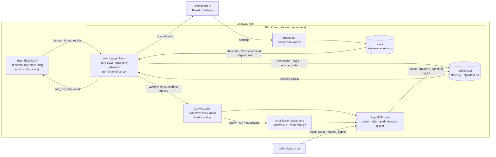
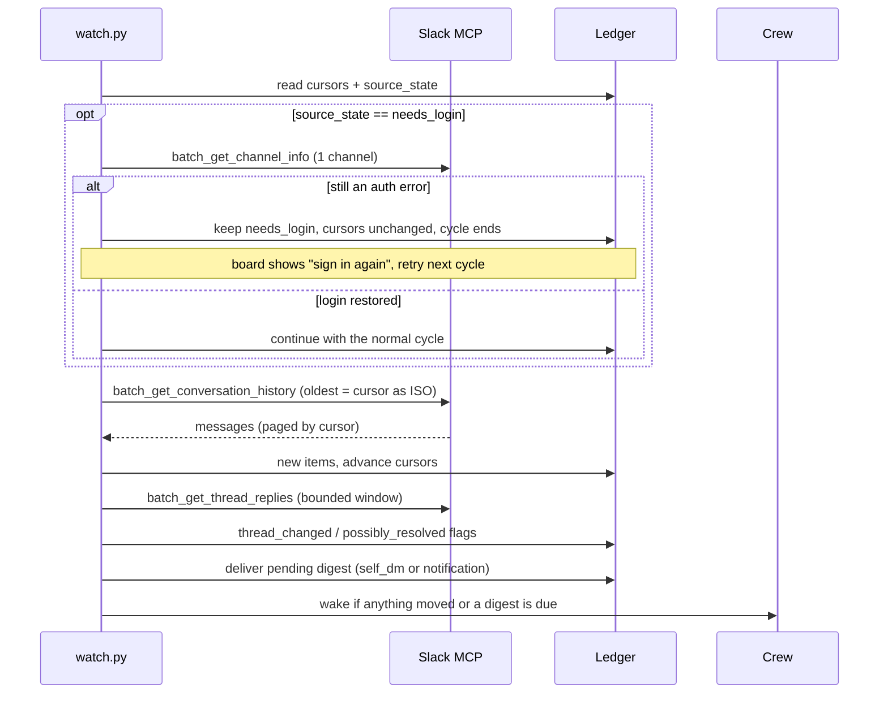

# Slack Radar

Slack Radar is a Slack triage crew that remembers. It reads Slack with your own
identity through your own Slack MCP server, so there is no bot to install, no
invite to send and nothing visible in the channel. One crew covers every channel
you choose: it classifies each new message as a bug report, feature request,
question, already-answered or noise, gives it a priority and a one-line summary,
links clusters of reports to existing GitHub issues and PRs, and notices when a
thread looks resolved. Everything it learns lives in a local ledger, so nothing
is triaged twice, and a daily digest tells you what mattered. It is modeled on
KiroCrew's built-in Issue Radar app.

[中文说明](#slack-radar-中文)

## How a message is triaged

1. **Poll.** An in-gateway loop (no model) asks your Slack MCP for everything
   newer than the app's own per-channel cursor, one batched call for all
   channels. Your Slack read state is never touched.
2. **Ledger.** New messages are written to the local ledger as items awaiting
   triage, with credential-shaped strings redacted, and the cursors advance.
3. **Radar Lead classifies.** If anything moved, the poller wakes the crew. The
   Radar Lead reads the ledger and sets category, priority and a summary on each
   new item, and decides which items form a cluster.
4. **Investigator links issues and PRs.** For a cluster, the lead spawns the
   read-only Investigator, which runs `gh search` and records matching issue
   and PR links on the items. You can also select items on the Board and press
   **Investigate**.
5. **Thread re-check.** Each cycle the poller re-reads a bounded window of open
   threads and flags *possibly resolved* ones (a ✅ reaction, a "fixed",
   "merged" or "thanks" reply, a deleted parent). Code never closes an item; the
   lead judges each flag.
6. **Digest.** When a digest is requested, the lead picks the top items and
   writes a headline. The gateway renders the text from the ledger and delivers
   it as a DM to yourself or as a dashboard notification.

### Architecture


```mermaid
flowchart LR
  subgraph host["Gateway host"]
    MCP["Your Slack MCP<br/>ai-community-slack-mcp<br/>(stdio subprocess)"]
    subgraph gw["Kiro Crew gateway (in-process)"]
      W["watch.py poll loop<br/>zero LLM · read-only allowlist<br/>per-channel cursor"]
      L[("ledger.json<br/>store.py · app data dir")]
      R["routes.py<br/>owner-only writes"]
      V[("vault<br/>slack-radar.settings")]
    end
    C["Crew session<br/>slot crew-slack-radar<br/>brief + nudge"]
    I["Investigator subagents<br/>SpawnSDK · read-only gh"]
    T["App MCP tools<br/>slack_radar_read / record / digest"]
  end
  UI["Dashboard UI<br/>Board · Settings"]
  MCP -- "history · thread replies" --> W
  W -- "new items · flags · source_state" --> L
  W -- "wake when something moved" --> C
  C -- "spawn_run / Investigate" --> I
  C --> T
  I --> T
  T -- "triage · memory · pending digest" --> L
  L -- "pending digest" --> W
  W -- "self_dm (only write)" --> MCP
  W -- "or notification" --> UI
  UI -- "settings" --> R --> V
  V -- "channels · MCP command · digest dest" --> W
  CRON["daily-digest cron"] -- "slack_radar_request_digest" --> T
```

One poll cycle:


```mermaid
sequenceDiagram
  participant W as watch.py
  participant M as Slack MCP
  participant L as Ledger
  participant C as Crew
  W->>L: read cursors + source_state
  opt source_state == needs_login
    W->>M: batch_get_channel_info (1 channel)
    alt still an auth error
      W->>L: keep needs_login, cursors unchanged, cycle ends
      Note over W,L: board shows "sign in again", retry next cycle
    else login restored
      W->>L: continue with the normal cycle
    end
  end
  W->>M: batch_get_conversation_history (oldest = cursor as ISO)
  M-->>W: messages (paged by cursor)
  W->>L: new items, advance cursors
  W->>M: batch_get_thread_replies (bounded window)
  W->>L: thread_changed / possibly_resolved flags
  W->>L: deliver pending digest (self_dm or notification)
  W->>C: wake if anything moved or a digest is due
```

An auth error at any read in the cycle takes the `needs_login` branch before any
cursor moves.

## Requirements

- KiroCrew 0.8 or newer.
- A Slack MCP server installed and logged in on the gateway host. The default
  command is `ai-community-slack-mcp` on `PATH`; any server exposing the same
  read tools works (`list_channels`, `batch_get_conversation_history`,
  `batch_get_thread_replies`, `batch_get_channel_info`, `batch_get_user_info`,
  plus `self_dm` if you want the digest as a DM).
- Python 3.10 or newer.
- Optional: `gh`, logged in, for the Investigator's GitHub searches.

## Install

```bash
kirocrew app install /path/to/slack-radar
```

`kirocrew app install` takes the local directory that contains `app.json`.

The app ships a Python backend and two agents, so KiroCrew asks you to trust it
before any of that code runs. For a CLI install, grant it yourself, then enable
the app:

```bash
kirocrew config set agent.apps_trusted '["slack-radar"]'
kirocrew config set agent.apps_trusted_local '["slack-radar"]'
kirocrew app enable slack-radar
```

`config set` replaces the whole list. If `kirocrew config get agent.apps_trusted`
already names other apps, keep them in the list. The app is off by default
(`defaultEnabled: false`).

To pick up a newer version, re-run `kirocrew app install` on the updated
directory, then use **Library → ⋮ → Sync** on the app so the gateway re-renders
its agent specs.

## First run

1. Open **Slack Radar → Settings**.
2. **Slack sign-in.** Under **Basics**, press **Check connection**; the status line should read *Slack connection: connected*. The Slack MCP command (default `ai-community-slack-mcp`, a single executable on `PATH`, no arguments) and the optional workspace URL (`https://yourteam.slack.com`, so permalinks open directly) are under **Advanced**.
3. **Channels.** List the channel IDs to watch, one per line (right-click a
   channel → *Copy link*, the `C…` segment). Any channel you can read works,
   up to 50.
4. **Digest destination.** *Dashboard notification only* (the default) or *DM
   to myself* (`self_dm`, which needs your Slack login). Save settings.
5. **Turn on the Crew switch** in the page header. The line under the title then reads *Watching N channels · running*. The first poll backfills the last 24 hours (configurable under Advanced).

Nothing is polled until at least one channel is set, and the crew never runs
until you start it.

## Usage

The page has four tabs. The header shows the tabs, a **Crew** switch (start or pause the crew) and a status line such as *Watching 2 channels · running*. When the Slack sign-in expires, a full-width banner at the top says *Slack connection: sign in again*, with a **Details** fold for the technical error.

| Tab | What it shows |
|---|---|
| Board | Slack connection and last poll, counts (awaiting triage, possibly resolved, open p0/p1, tracked), then the ledger filtered by status (at most two tags per row: status and priority; the rest on hover), then the last digest with **Request digest**, then per-channel poll health. On the right, the Radar Lead chat card with **Poll now**, the crew phase and next step, and three quick questions (*What needs me today?*, *Draft today's digest*, *Re-check resolved threads*). Select items and press **Investigate** (optionally naming an `owner/name` repo) to spawn the Investigator on them |
| Team | Who is on the crew: Radar Lead (*Resident*), Investigator (*Joins on demand*), Thread Watcher (*Coming soon*) and the Poller (code, no model), each with a live status. Agent ids are in a **Details** fold |
| Activity | The work log: polls that moved something, login lost or restored, crew notes, digests, settings changes, crew session moves |
| Settings | **Basics** first: Slack connection check, watched channels, digest destination (plus your Slack login for a DM), poll interval. **Advanced** (folded): Slack MCP command, workspace URL, backfill, and the crew agent, model and the *Unattended mode (auto-approve investigator commands)* switch |

To get a digest on a schedule, resume the paused `daily-digest` cron (weekdays
16:00 UTC) in the Schedule view. To get one now, press **Request digest** on the
Board.

## The team

| Member | Role | What they do |
|---|---|---|
| Radar Lead | Lead · resident | The crew session itself (agent `slack-radar-crew`, slot `crew-slack-radar`). Triages each new item (category, priority, summary), decides clusters, judges possibly-resolved threads, writes the digest headline, and is the one you talk to |
| Investigator | Research · leaf | Spawned per cluster (agent `slack-radar-investigator`). Runs read-only `gh search` / `gh issue view` / `gh pr view` and records matching issue and PR links on the items. Never writes to GitHub or Slack |
| Thread Watcher | Review · leaf | **Coming soon**, not shipped yet. Will judge batches of possibly-resolved threads. Today the Radar Lead does this itself |
| Poller | System · code, no model | Runs inside the gateway. Cursor reads, thread re-checks, login-expiry detection, and digest delivery. Wakes the lead only when something moved |

### Desk

The crew's rules and interfaces live in `desk/`. [desk/CHARTER.md](desk/CHARTER.md) is the charter: the roster, who dispatches whom (only the Radar Lead spawns), what may never be sent to Slack, public vs local data, unattended scope and stop conditions. [desk/CONTRACT.md](desk/CONTRACT.md) is the machine contract: fixed agent names, the ledger format, the MCP tools and the HTTP routes. [desk/members.json](desk/members.json) is the roster as data, and `GET /api/apps/slack-radar/org` returns it with each member's live status.

## Configuration

Settings live in the gateway's encrypted vault (entry `slack-radar.settings`) and
are written only through the owner-gated Settings page.

| Key | Default | What it does |
|---|---|---|
| `slack_mcp_command` | `ai-community-slack-mcp` | The Slack MCP executable the gateway spawns. One executable, no arguments, no shell syntax |
| `channels` | `[]` | Channel IDs to watch (at most 50) |
| `digest_destination` | `dashboard` | `dashboard` (notification only) or `self_dm` (DM to yourself) |
| `slack_login` | your OS login, if it looks like a Slack login | Needed for `self_dm` |
| `workspace_url` | empty | `https://yourteam.slack.com`, used only to build permalinks |
| `poll_interval_secs` | `300` | Seconds between polls, 60–3600 |
| `backfill_hours` | `24` | How far back the first poll reads, 0–168 |
| `recheck_days` | `7` | How old a thread can be and still be re-checked, 1–30. No UI field |
| `recheck_max_per_cycle` | `20` | Threads re-checked per cycle, 0–50. No UI field |

The Crew part of **Settings → Advanced** writes the crew record (`crew.json` in the app data dir), not the
vault: `agent` (default `slack-radar-crew`; an override only, your own agents are
never modified), `model` (empty = the agent's default), and `unattended` (the
*Unattended mode* switch, off by default).

## What runs in the background

- **The poll loop.** Started by the app's `on_startup` hook as a gateway task and
  stopped on shutdown. It runs every `poll_interval_secs` once at least one
  channel is set, and costs no model turns. It wakes the crew only when a poll
  moved something or a digest is due, so an idle workspace costs nothing.
- **The `daily-digest` cron.** Shipped paused (`0 16 * * 1-5`, UTC). When you
  resume it, it calls `slack_radar_request_digest` once and stops; the Radar
  Lead composes the digest in its own session and the poller delivers it.

Disabling the app stops the loop and revokes the crew's auto-approve grant.

## Autonomy and security

- **Read-only Slack.** The MCP client admits only five read tools (`list_channels`,
  `batch_get_conversation_history`, `batch_get_thread_replies`,
  `batch_get_channel_info`, `batch_get_user_info`); any other tool name raises
  before it reaches the process. The one write, `self_dm`, is a separate method
  called only from the digest path. No replies, reactions, drafts or channel
  posts.
- **No shell on the lead.** The Radar Lead's agent has no `execute_bash` and no
  `fs_write`. Its only tools are the ledger tools, `spawn_run` / `spawn_status` /
  `spawn_list`, `fs_read`, `grep`, `glob` and `thinking`, and all of them are
  pre-approved, so the lead never prompts and never gains a tool, in either mode.
- **The Investigator has a shell, and the crew's investigator always asks.** When
  the Radar Lead spawns it with `spawn_run`, the host asks you to approve the spawn
  and then each command. Unattended mode does not change that: the host passes a
  child only the parent's interactive trust flag, never a scoped grant. An
  unanswered prompt is denied after two hours.
- **The board's Investigate button needs unattended mode.** It spawns through the
  app spawn SDK, which the host runs with every command auto-approved for the whole
  run. So the button is refused (`unattended_required`) while unattended mode is
  off.
- **Unattended mode is off by default.** When on, the crew's session holds a
  scoped, 15-minute, SEL-audited grant renewed by each poll while the crew is
  live, never the interactive trust flag, and re-checked on every approval, so a
  grant that lapses mid-turn makes the next prompt ask again. Because the lead's
  tools are already pre-approved, the grant changes nothing for crew turns today;
  what the toggle does in practice is let the Investigate button run. Turn it on
  only when every watched channel is trusted. See
  [docs/unattended-mode.md](docs/unattended-mode.md) for the approval chain.
- **Prompt injection.** The crew reads text anyone in your channels can write.
  The ledger tools and the investigation prompt label message text as untrusted
  data, and both agents are told never to follow instructions in it. That is a mitigation,
  not a guarantee, which is why the lead has no shell and auto-approve is opt-in.
- **Token-free.** No Slack credential is stored. The Slack MCP authenticates with
  your own session.
- **Settings are authority.** They sit in the gateway vault, which agents can
  neither read nor write. Settings, MCP probe, start/pause, poll, digest and
  investigate routes are owner-only, so the crew cannot change what is read,
  which binary runs, or its own auto-approval.
- Credential-shaped strings in messages are redacted before they reach the
  ledger. The ledger is local, but other agents on this machine can read it.
  Because it reads with your identity, private channels you belong to can be
  watched too.

## Troubleshooting

- **The page says *Slack connection: sign in again*.** Your Slack MCP's login expired. Log in to
  the Slack MCP again on the gateway host, then press **I signed in, check again**. Polling stays paused with cursors
  unchanged and resumes on the next cycle after a read succeeds; an expired login
  is never reported as "no new messages".
- **The crew says its ledger tools are "not granted" or missing.** Its agent spec
  is stale, usually after an update. Run **Library → ⋮ → Sync** on Slack Radar,
  then turn the **Crew** switch on again.
- **The crew's session moved to `crew-slack-radar-g2`.** Expected. When the
  existing slot is bound to a different agent (for example one created by an
  older version on `kirocrew`), the app archives it and opens a fresh slot with a
  generation suffix. The Activity tab logs the move. Use the newest session.
- **Status reads *Slack connection: not installed* or *missing read access*.**
  The Slack MCP command is not on the gateway's `PATH`, or that server does not
  expose the five read tools listed above.

## Development

```bash
python3 -m pytest tests -q          # MCP guard, ts<->ISO, poll cycle, needs-login, digest, ledger tools, slot moves
python3 -m json.tool app.json > /dev/null && for f in agents/*.json; do python3 -m json.tool "$f" > /dev/null; done
cd ui && npm install --legacy-peer-deps && npx vite build   # rebuilds ui/dist/index.mjs
KIROCREW_WEBSITE=/path/to/KiroCrew/website node docs/screenshots/capture/shoot.mjs   # regenerate screenshots from fake data
```

The UI bundle `ui/dist/index.mjs` is committed so a plain install works without
a Node toolchain.

## Repository layout

```
slack-radar/
├── app.json                    manifest
├── agents/slack-radar-crew.json          the Radar Lead's agent (ledger tools, no shell)
├── agents/slack-radar-investigator.json   read-only GitHub investigator
├── backend/
│   ├── routes.py               HTTP API (backend.hooks.routes)
│   ├── hooks.py                on_startup / on_shutdown: poll loop, grant revoke
│   ├── watch.py                poll cycle, thread re-check, ts<->ISO, digest render/deliver
│   ├── slack_mcp.py            stdio client for your Slack MCP, read-only allowlist + self_dm
│   ├── settings.py             vault-backed settings
│   ├── crew_runtime.py         crew session, brief injection, nudge, grant, slot moves
│   ├── store.py                ledger (stdlib only, shared with the MCP server)
│   ├── mcp_server.py           crew tools: slack_radar_read/record/digest/request_digest
│   ├── crew_brief.md           the crew's standing instructions
│   ├── org.py                  desk/members.json loader and the GET /org view
│   └── crew_ledger_spec.md     pointer to desk/CONTRACT.md
├── desk/                       CHARTER.md, CONTRACT.md (ledger fields, tools, routes), members.json
├── docs/screenshots/           screenshots and the fake-data capture harness
├── ui/                         React page (Board / Activity / Settings)
└── tests/                      test_slack_radar.py, test_org.py
```

## Screenshots

Rendered from fake demo data (`docs/screenshots/capture/`); no real Slack content.

| | |
|---|---|
|  |  |
| Board: Slack connection, counts, the triaged ledger, then digest and channels; the Radar Lead chat card with quick questions | Settings: Basics (connection, channels, digest, poll interval) and the opened Advanced section |
|  |  |
| Sign-in expired: a banner says so and polling pauses, instead of an empty queue | Team: who is on the crew and what each one is doing |

## License

MIT, as declared in `app.json`.

---

<a id="slack-radar-中文"></a>

# Slack Radar（中文）

Slack Radar 是一个“有记性”的 Slack 分诊小组。它通过你自己的 Slack MCP
服务器、用你自己的身份读取 Slack：不用装机器人，不用邀请谁进频道，频道里也看不出任何痕迹。
一个小组负责你选定的所有频道：把每条新消息归为 bug 报告、功能需求、提问、已有答复或噪音，
标上优先级并写一句话摘要；把同类报告聚成一簇，关联到已有的 GitHub issue 和 PR；
还会留意哪些线程看起来已经解决。所有结论都记在本地台账里，同一条消息不会被分诊两次；
每天一份摘要告诉你哪些事值得看。它的设计参照了 KiroCrew 内置的 Issue Radar 应用。

## 一条消息是怎么被分诊的

1. **轮询。** 网关内的一个循环（不调用模型）向你的 Slack MCP 请求比本应用自己的
   频道游标更新的所有消息，所有频道合并成一次批量调用。你在 Slack 里的已读状态不会被改动。
2. **台账。** 新消息作为“待分诊”条目写入本地台账，像凭据的字符串会先被打码，然后游标前移。
3. **雷达组长分类。** 只要有变化，轮询器就唤醒小组。雷达组长读取台账，为每条新条目定类别、
   优先级和摘要，并决定哪些条目归为一簇。
4. **调查员关联 issue 和 PR。** 对于一簇报告，组长会派出只读的调查员，用 `gh search`
   查找并把匹配的 issue、PR 链接记到条目上。你也可以在看板上勾选条目后点 **Investigate**。
5. **线程复查。** 每一轮，轮询器会在有限的窗口内重读仍打开的线程，把“可能已解决”的标出来
   （✅ 表情、“fixed”“merged”“thanks”之类的回复、原消息被删除）。代码从不自行关闭条目，
   每个标记都由组长判断。
6. **摘要。** 请求摘要时，组长挑出最重要的条目并写一句标题；网关从台账渲染出正文，
   以私信发给你自己，或作为仪表盘通知送达。

架构图和单轮轮询的时序图见英文部分的 [Architecture](#architecture)，这里不再重复。

## 环境要求

- KiroCrew 0.8 或更新版本。
- 网关所在主机上已安装并登录好一个 Slack MCP 服务器。默认命令是 `PATH` 上的
  `ai-community-slack-mcp`；只要提供同样的读取工具（`list_channels`、
  `batch_get_conversation_history`、`batch_get_thread_replies`、
  `batch_get_channel_info`、`batch_get_user_info`，想用私信收摘要还需要 `self_dm`），
  其他服务器也可以。
- Python 3.10 或更新版本。
- 可选：已登录的 `gh`，供调查员搜索 GitHub。

## 安装

```bash
kirocrew app install /path/to/slack-radar
```

`kirocrew app install` 接收包含 `app.json` 的本地目录。

本应用带有 Python 后端和两个 agent，所以 KiroCrew 会先要求你信任它，然后才会运行这些代码。
用命令行安装时，需要自己授予信任，再启用应用：

```bash
kirocrew config set agent.apps_trusted '["slack-radar"]'
kirocrew config set agent.apps_trusted_local '["slack-radar"]'
kirocrew app enable slack-radar
```

`config set` 会整体替换列表。如果 `kirocrew config get agent.apps_trusted`
里已经有别的应用，记得一并保留。应用默认不启用（`defaultEnabled: false`）。

升级时，对更新后的目录重新执行 `kirocrew app install`，然后在
**Library → ⋮ → Sync** 里同步本应用，让网关重新生成它的 agent 配置。

## 首次运行

1. 打开 **Slack Radar → Settings**。
2. **Slack 登录。** 在 **Basics** 里点 **Check connection**，状态行应显示 *Slack connection: connected*。Slack MCP 命令（默认 `ai-community-slack-mcp`，`PATH` 上的单个可执行文件，不带参数）和可选的工作区地址（`https://yourteam.slack.com`，让消息链接能直接打开）在 **Advanced** 里。
3. **频道。** 每行一个要监听的频道 ID（右键频道 → *Copy link*，取其中 `C…` 那一段）。
   只要你能读的频道都行，最多 50 个。
4. **摘要去向。** *Dashboard notification only*（默认，仅仪表盘通知）或
   *DM to myself*（`self_dm`，需要填你的 Slack 登录名）。保存设置。
5. **打开页头的 Crew 开关。** 标题下的状态行会变成 *Watching N channels · running*。第一次轮询会回溯最近 24 小时（可在 Advanced 里调）。

在设置至少一个频道之前不会轮询；在你点启动之前，小组也不会运行。

## 使用

页面有四个标签页。页头放着标签页、一个 **Crew** 开关（启动或暂停小组）和一行状态，例如 *Watching 2 channels · running*。Slack 登录过期时，页面顶部会出现一条通栏横幅 *Slack connection: sign in again*，技术细节收在 **Details** 折叠里。

| 标签页 | 内容 |
|---|---|
| Board（看板） | Slack 连接与最近一次轮询；计数（待分诊、可能已解决、未关闭的 p0/p1、跟踪总数）；紧接着是按状态筛选的台账（每行最多两个标签：状态和优先级，其余悬停可见）；然后是最近一次摘要和 **Request digest**；最后是各频道轮询健康度。右侧是雷达组长聊天卡片，带 **Poll now**、小组阶段与下一步，以及三个快捷问题（*What needs me today?*、*Draft today's digest*、*Re-check resolved threads*）。勾选条目后点 **Investigate**（可选填一个 `owner/name` 仓库）即可派调查员去查 |
| Team（团队） | 小组成员：雷达组长（*Resident*，常驻）、调查员（*Joins on demand*，按需加入）、线程观察员（*Coming soon*，即将推出）和轮询器（代码，不用模型），各带实时状态。agent id 收在 **Details** 折叠里 |
| Activity（动态） | 工作日志：有变化的轮询、登录失效与恢复、小组备注、摘要、设置变更、小组会话迁移 |
| Settings（设置） | 先是 **Basics**：Slack 连接检查、监听的频道、摘要去向（选私信时还有 Slack 登录名）、轮询间隔。**Advanced**（默认折叠）：Slack MCP 命令、工作区地址、回溯时长，以及小组的 agent、模型和 *Unattended mode (auto-approve investigator commands)* 开关 |

想定时收摘要，就在 Schedule 页面恢复已暂停的 `daily-digest` 定时任务（工作日 UTC 16:00）；
想马上要一份，点看板上的 **Request digest**。

## 团队

| 成员 | 角色 | 职责 |
|---|---|---|
| 雷达组长 | 组长 · 常驻 | 就是小组会话本身（agent `slack-radar-crew`，槽位 `crew-slack-radar`）。给每条新条目分诊（类别、优先级、摘要），决定如何聚簇，判断“可能已解决”的线程，写摘要标题，也是你对话的对象 |
| 调查员 | 调研 · 临时 | 每簇派一个（agent `slack-radar-investigator`）。只读地运行 `gh search` / `gh issue view` / `gh pr view`，把匹配的 issue、PR 链接记到条目上。从不写 GitHub 或 Slack |
| 线程观察员（即将推出） | 复核 · 临时 | **即将推出，目前尚未提供。** 届时负责成批判断“可能已解决”的线程；现阶段由雷达组长自己判断 |
| 轮询器 | 系统 · 代码，不用模型 | 运行在网关内。负责游标读取、线程复查、登录失效检测和摘要投递；只有真有变化时才唤醒组长 |

### Desk（工作台）

小组的规则和接口放在 `desk/` 里。[desk/CHARTER.md](desk/CHARTER.md) 是章程：成员、谁派谁（只有雷达组长会派生）、绝不能发到 Slack 的东西、公开与本地数据、无人值守的范围和停止条件。[desk/CONTRACT.md](desk/CONTRACT.md) 是机器契约：固定的 agent 名字、台账格式、MCP 工具和 HTTP 接口。[desk/members.json](desk/members.json) 是成员名单的数据形式，`GET /api/apps/slack-radar/org` 返回它，并附上每个成员的实时状态。

## 配置

设置保存在网关的加密保险库里（条目 `slack-radar.settings`），只能通过仅限所有者的设置页写入。

| 键 | 默认值 | 作用 |
|---|---|---|
| `slack_mcp_command` | `ai-community-slack-mcp` | 网关要启动的 Slack MCP 可执行文件。单个可执行文件，不带参数，不含 shell 语法 |
| `channels` | `[]` | 要监听的频道 ID（最多 50 个） |
| `digest_destination` | `dashboard` | `dashboard`（仅通知）或 `self_dm`（私信给自己） |
| `slack_login` | 你的系统登录名（格式像 Slack 登录名时） | `self_dm` 需要它 |
| `workspace_url` | 空 | `https://yourteam.slack.com`，只用来生成消息链接 |
| `poll_interval_secs` | `300` | 两次轮询间隔的秒数，60–3600 |
| `backfill_hours` | `24` | 首次轮询回溯的小时数，0–168 |
| `recheck_days` | `7` | 多久以内的线程仍会被复查（天），1–30。界面上没有对应字段 |
| `recheck_max_per_cycle` | `20` | 每轮最多复查的线程数，0–50。界面上没有对应字段 |

**Settings → Advanced** 里的 Crew 部分写入的是小组记录（应用数据目录下的 `crew.json`），而不是保险库：`agent`
（默认 `slack-radar-crew`；只是覆盖项，你自己的 agent 永远不会被修改）、`model`
（留空即用 agent 的默认模型）、`unattended`（*Unattended mode* 开关，默认关闭）。

## 后台会跑什么

- **轮询循环。** 由应用的 `on_startup` 钩子作为网关任务启动，关闭时停止。设置了至少一个频道后，
  每隔 `poll_interval_secs` 跑一次，不消耗模型调用。只有轮询发现变化或到了该出摘要时才唤醒小组，
  所以工作区安静时不花任何成本。
- **`daily-digest` 定时任务。** 随应用附带，默认暂停（`0 16 * * 1-5`，UTC）。恢复后，它只调用一次
  `slack_radar_request_digest` 就结束；摘要由雷达组长在自己的会话里撰写，再由轮询器投递。

停用应用会停止轮询循环，并撤销小组的自动批准授权。

## 自主性与安全

- **Slack 只读。** MCP 客户端只放行五个读取工具（`list_channels`、
  `batch_get_conversation_history`、`batch_get_thread_replies`、
  `batch_get_channel_info`、`batch_get_user_info`），其他工具名在到达进程前就会被拒绝。
  唯一的写操作 `self_dm` 是单独的方法，只在投递摘要时调用。不回复、不加表情、不存草稿、不在频道发言。
- **组长没有 shell。** 雷达组长的 agent 没有 `execute_bash` 和 `fs_write`。它只有台账工具、
  `spawn_run` / `spawn_status` / `spawn_list`、`fs_read`、`grep`、`glob` 和 `thinking`，
  而且都已预先批准，所以无论哪种模式，组长都不会弹确认，也不会多出别的工具。
- **调查员有 shell，小组派出的调查员总是要确认。** 雷达组长用 `spawn_run` 派出调查员时，
  网关会先请你批准这次派出，再逐条批准它的命令。开启无人值守模式也不会改变这一点：
  网关只把父会话的交互式信任开关传给子 agent，从不传限定范围的授权。无人应答的确认两小时后自动拒绝。
- **看板上的 Investigate 按钮需要无人值守模式。** 它通过应用的 spawn SDK 派出调查员，
  网关对这类派出在整个运行期间自动批准每条命令。所以无人值守模式关闭时，这个按钮会被拒绝
  （`unattended_required`）。
- **无人值守模式默认关闭。** 开启后，小组会话持有一个限定范围、15 分钟有效、记入 SEL 审计的授权，
  在小组运行期间由每次轮询续期，绝不是交互式的信任开关；每次审批都会重新检查它，所以授权在
  一轮中途过期后，下一次确认会重新询问你。由于组长的工具都已预先批准，这个授权目前对小组的回合
  没有任何影响；这个开关实际的作用是允许 Investigate 按钮运行。只有当所有监听频道都可信时才建议开启。
  审批链的细节见 [docs/unattended-mode.md](docs/unattended-mode.md)。
- **提示注入。** 小组读的是频道里任何人都能写的文字。台账工具和调查提示都把消息正文标为不可信数据，
  两个 agent 也都被要求绝不执行其中的指令。这只是缓解而非保证，所以组长不给 shell，自动批准也需要主动开启。
- **不存令牌。** 不保存任何 Slack 凭据，Slack MCP 用的是你自己的登录会话。
- **设置即权限。** 设置存放在网关保险库里，agent 既读不到也写不了。设置、MCP 探测、启动/暂停、
  轮询、摘要和调查等接口都仅限所有者调用，因此小组无法改变读取范围、要运行的程序，也无法给自己开自动批准。
- 消息里像凭据的字符串在写入台账前会被打码。台账存在本地，但本机上的其他 agent 可以读到。
  因为是用你的身份读取，你所在的私有频道也可以被监听。

## 排障

- **页面显示 *Slack connection: sign in again*。** 你的 Slack MCP 登录过期了。在网关主机上重新登录 Slack MCP，然后点 **I signed in, check again**。
  这期间轮询暂停、游标不动；下一轮读取成功后自动恢复。登录过期绝不会被当成“没有新消息”。
- **小组说台账工具“not granted”或找不到。** 它的 agent 配置过时了，通常发生在升级之后。
  在 **Library → ⋮ → Sync** 同步 Slack Radar，然后重新打开 **Crew** 开关。
- **小组会话迁到了 `crew-slack-radar-g2`。** 这是正常的。如果现有槽位绑定的是别的 agent
  （比如旧版本在 `kirocrew` 上建的），应用会把它归档，并新开一个带代数后缀的槽位。
  Activity 页会记录这次迁移；使用最新的那个会话即可。
- **状态显示 *Slack connection: not installed* 或 *missing read access*。** Slack MCP 命令不在网关的
  `PATH` 上，或者该服务器没有提供上面列出的五个读取工具。

## 开发

```bash
python3 -m pytest tests -q          # MCP 防护、ts<->ISO、轮询、needs-login、摘要、台账工具、槽位迁移
python3 -m json.tool app.json > /dev/null && for f in agents/*.json; do python3 -m json.tool "$f" > /dev/null; done
cd ui && npm install --legacy-peer-deps && npx vite build   # 重新构建 ui/dist/index.mjs
KIROCREW_WEBSITE=/path/to/KiroCrew/website node docs/screenshots/capture/shoot.mjs   # 用假数据重新生成截图
```

UI 产物 `ui/dist/index.mjs` 已提交到仓库，所以直接安装不需要 Node 工具链。

## 仓库结构

```
slack-radar/
├── app.json                    应用清单
├── agents/slack-radar-crew.json          雷达组长的 agent（台账工具，无 shell）
├── agents/slack-radar-investigator.json   只读的 GitHub 调查员
├── backend/
│   ├── routes.py               HTTP 接口（backend.hooks.routes）
│   ├── hooks.py                on_startup / on_shutdown：轮询循环、撤销授权
│   ├── watch.py                轮询、线程复查、ts<->ISO、摘要渲染与投递
│   ├── slack_mcp.py            连接你的 Slack MCP 的 stdio 客户端，只读白名单 + self_dm
│   ├── settings.py             基于保险库的设置
│   ├── crew_runtime.py         小组会话、简报注入、唤醒、授权、槽位迁移
│   ├── store.py                台账（仅用标准库，与 MCP 服务器共用）
│   ├── mcp_server.py           小组工具：slack_radar_read/record/digest/request_digest
│   ├── crew_brief.md           小组的常驻指令
│   ├── org.py                  desk/members.json 的加载和 GET /org 视图
│   └── crew_ledger_spec.md     指向 desk/CONTRACT.md
├── desk/                       CHARTER.md、CONTRACT.md（台账字段、工具、接口）、members.json
├── docs/screenshots/           截图和假数据截图工具
├── ui/                         React 页面（Board / Activity / Settings）
└── tests/                      test_slack_radar.py, test_org.py
```

## 截图

用假的演示数据渲染（`docs/screenshots/capture/`），不含任何真实 Slack 内容。

| | |
|---|---|
|  |  |
| 看板：Slack 连接、计数、分诊后的台账，其后是摘要和频道；右侧是带快捷问题的雷达组长聊天卡片 | 设置：Basics（连接、频道、摘要、轮询间隔）和展开后的 Advanced |
|  |  |
| 登录过期：顶部横幅直接说明，轮询暂停，而不是显示一个空队列 | 团队：小组有哪些成员、各自在做什么 |

## 许可

MIT（见 `app.json` 中的声明）。
